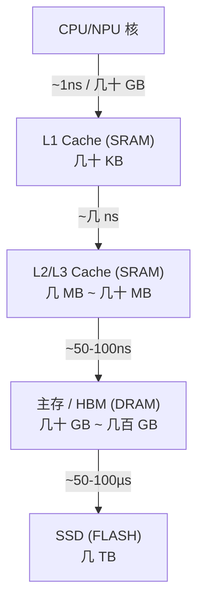

---
tags:
  - 内存架构
  - DRAM
  - SRAM
  - FLASH
  - 半导体
created: 2026-08-14
updated: 2026-08-14
---

# DRAM、SRAM、FLASH

> 三种主流存储器的核心差异在于**性能、成本与易失性**。理解它们才能理解 HBM（本质是 DRAM 的一种形态）、cache（SRAM）、以及存储层级（memory hierarchy）的构成。
>
> 相关笔记：[[HBM和DDR]] · [[带宽和频率]] · [[大核与小核]]

---

## 一、存储单元原理

### 1.1 SRAM（Static RAM）——触发器

- 一个单元 = **6 个晶体管**（6T：两个交叉耦合反相器 + 两个访问管），状态由**正反馈锁存**，不需要刷新。
- 特性：**快、贵、面积大、低功耗（静态时）**，无刷新开销。
- 用途：CPU/NPU 的 **cache（L1/L2/L3）、寄存器堆（register file）、片上 buffer**。

```
         VDD
        ┌──┐
  BL ──┬┤1 ├──┬── BLB         反相器 1 的输出接到反相器 2 的输入
       │ └──┘  │              正反馈 → 状态稳定保持
       │       │
  WL ──┴── 访问管（读/写门控）──┴──
```

### 1.2 DRAM（Dynamic RAM）——电容

- 一个单元 = **1 个晶体管 + 1 个电容（1T1C）**，用**电容充电**表示 1/0。
- 电容会漏电 → **必须周期性刷新（refresh）**；读取会破坏电荷 → **读后重写**。
- 特性：**密度高、便宜、需要刷新、延迟大于 SRAM**。
- 用途：**主存、HBM、GDDR**——所有"大容量工作内存"。

```
   WL（字线）─ 访问管 ─┬─ 存储节点（电容）
                      │
   BL（位线）─────────┘
   ※ 电容电荷漏失 → 每 64ms（典型）必须刷新一次
```

### 1.3 FLASH——浮栅

- 单元 = 1 个带**浮栅（floating gate）/电荷陷阱层**的晶体管，电荷被"困"在绝缘层里 → **非易失**。
- 写入靠隧穿（Fowler-Nordheim），**寿命有限**（擦写次数 P/E cycle，TLC ~1000 次量级）；读快写慢、**先擦后写**（页粒度）。
- 特性：**非易失、便宜、慢（尤其写）、有寿命**。
- 用途：**SSD、eMMC/UFS、固件存储**（BIOS/固件镜像就存在 NOR Flash 里，见 [[BIOS和UEFI]]）。

```
       控制栅（CG）
        ┌──────┐
        │ 浮栅  │ ← 电荷困在此处（隧穿写入）→ 无电也保持
        └──────┘
        ┌──────┐
        │ 沟道  │
        └──────┘
```

---

## 二、三种存储器对比

| 维度 | SRAM | DRAM | FLASH |
|------|------|------|-------|
| 存储原理 | 触发器正反馈 | 电容电荷 | 浮栅电荷 |
| 单元晶体管数 | 6T | 1T1C | 1T（多层单元） |
| 易失性 | **易失** | **易失** | **非易失** |
| 刷新需要 | 否 | **是**（典型 64ms 周期） | 否 |
| 读延迟 | ~1-10ns | ~50-100ns | ~50-100µs（读） |
| 写延迟 | ~1-10ns | ~10-20ns | ~100µs-1ms（写/擦除慢） |
| 密度/成本 | 最低/最贵 | 中等 | 最高/最便宜 |
| 寿命 | 无限 | 长（刷新保护） | **有限（P/E cycle）** |
| 典型用途 | Cache、寄存器堆、片上 SRAM | 主存、HBM、GDDR | SSD、固件存储 |

---

## 三、存储层级（Memory Hierarchy）——它们怎么配合



**核心思想（局部性原理）**：
- 越靠近核：越快、越贵、越小（SRAM）
- 越远离核：越慢、越便宜、越大（DRAM → FLASH）
- **HBM 的位置**：它是"放在 NPU 旁边的 DRAM"——用 3D 堆叠/TSV 把 DRAM 的延迟和带宽大幅改善（见 [[HBM和DDR]]），本质上是在 DRAM 这一层做文章，缩短"DRAM 离核太远"的代价。

**容量-速度-成本不可能三角**：没有任何一种存储器同时快、大、便宜——这就是层级存在的根本原因。

---

## 参考资料

- [What is DRAM?（TechTarget）](https://www.techtarget.com/searchstorage/definition/DRAM)
- [SRAM vs DRAM 对比（GeeksforGeeks）](https://www.geeksforgeeks.org/difference-between-sram-and-dram/)
- [NAND Flash 原理（Western Digital 技术文章）](https://www.westerndigital.com/solutions/nand-flash)
- 关联笔记：[[HBM和DDR]] · [[带宽和频率]] · [[大核与小核]] · [[纠错算法（ecc、RS）和symbol]]
