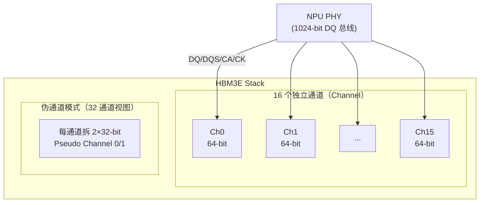

---
tags:
  - HBM
  - IO
  - 内存架构
  - 半导体
created: 2026-08-14
updated: 2026-08-14
---

# IO：HBM 物理接口

> 接口宽度是 HBM 的核心设计参数：**1024-bit（HBM3）→ 2048-bit（HBM4）**。本文拆解 HBM 的 IO 结构——通道/伪通道、命令与数据总线、时钟，以及从 PHY 引脚到 DRAM 单元的物理路径（TSV/μbump/interposer）。
>
> 相关笔记：[[PHY]] · [[HBM和DDR]] · [[从总线访问到PA]] · [[固件启动全流程]]

---

## 一、HBM 接口总览（以 HBM3E 为例）



**关键数字（HBM3E）**：
- 每堆栈 **1024-bit DQ** = 16 通道 × 64-bit（HBM4 为 32 通道 × 64-bit = 2048-bit）
- 伪通道模式：每个 64-bit 通道拆成 **2×32-bit** → 32 伪通道（HBM4 为 64 伪通道）
- 数据率 9.6 Gbps → 每堆栈 1.2 TB/s（公式：1024 × 9.6 ÷ 8）

---

## 二、通道与伪通道（Channel & Pseudo Channel）

### 2.1 为什么要有通道

- 1024 根 DQ 如果当成一个整体，调度和错误隔离都难。
- 拆成多个独立通道（HBM3E 为 16 个）：**每个通道有自己的命令/地址（CA）与数据总线，可独立调度** → 并行度高、错误隔离粒度细（某通道坏了可单独降级）。

### 2.2 伪通道（Pseudo Channel）——更细的并行

- HBM3/HBM3E 中每个 64-bit 通道拆成 **2 个 32-bit 伪通道**，**各自独立 activate/read/write**（HBM2E 为 128-bit 通道拆成 2×64-bit）。
- 收益：更细的并行度（HBM3E 32 个独立访问单元）→ 利用率更高；代价：控制逻辑与布线更复杂。
- **对固件的意义**：training 必须覆盖每个伪通道（[[Training：校准与训练全流程]]）；RAS 隔离粒度也细到伪通道（[[内核内存错误处理（CE与UCE）]]）。

| 代际 | 通道数 × 位宽 | 伪通道数 × 位宽 | 总位宽 |
|------|--------------|----------------|--------|
| HBM2E | 8 × 128-bit | 16 × 64-bit | 1024-bit |
| HBM3 / HBM3E | 16 × 64-bit | 32 × 32-bit | 1024-bit |
| HBM4 | 32 × 64-bit | 64 × 32-bit | 2048-bit |

---

## 三、信号分组

| 信号组           | 方向          | 作用                             | 备注                            |
| ------------- | ----------- | ------------------------------ | ----------------------------- |
| DQ[1023:0]    | 双向          | 数据                             | 16 通道 × 64（HBM3E）             |
| DQS（每字节组）     | 双向          | 数据选通                           | 训练对齐目标（[[Training：校准与训练全流程]]） |
| CA（命令/地址）     | 单向（NPU→HBM） | activate/read/write/refresh/MR | 每通道独立                         |
| CK / CK_n     | 单向          | 差分命令时钟                         | 命令时序基准                        |
| RESET_n / CKE | 单向          | 复位/时钟使能                        | 初始化顺序关键（[[固件启动全流程]]）          |
| ZQ            | —           | 阻抗校准参考（240Ω）                   | ZQ 校准用                        |
| 电源/地          | —           | VDD/VDDQ/VDD2/VPP              | 多电源域                          |

> 注意：**命令/地址是每通道独立的低速总线，数据是超宽高速总线**——HBM 用"宽数据 + 相对简单命令"换带宽，与 DDR 的"窄数据 + 高频"形成对比（[[HBM和DDR]]）。

---

## 四、物理路径：从 PHY 到 DRAM 单元

```
NPU PHY 引脚
   │  走线（interposer 布线层）
   ▼
μBump（微凸点，间距 ~40μm 量级）
   │
   ▼
Base Die（HBM 底部逻辑层）
   │  TSV（硅通孔，直径 ~5-10μm）
   ▼
DRAM Die 1 → Die 2 → ... → Die N（堆叠层）
   └──────────── 每层 TSV 贯穿 ────────────┘
```

| 层级 | 角色 | 关键参数（示意） |
|------|------|----------------|
| Interposer 走线 | PHY↔μbump 的布线 | 线宽/线距 µm 级 |
| μBump | die↔interposer 键合 | 间距 ~40μm（HBM3）；hybrid bonding <10μm（SK 12 层混合键合验证完成，2026） |
| TSV | 垂直贯穿每层 die | 直径 5-10μm，间距 ~40-55μm |
| Base Die | 信号汇聚/重分布 | HBM4 逻辑化演进（FinFET 工艺） |

> **数据可用性说明**：TSV/μbump 的精确微米级数值无可靠公开来源（SK hynix 仅披露 16Gb 裸片厚约 30μm、TSV 互连），上表数值为行业资料量级估算，仅作示意。

> **要点**：物理路径的异构性与长度差异造成显著的 pin-to-pin 延迟差，这是 training 必须逐 pin 校准的根本原因，也是 HBM 厂商与 SoC 厂商联合进行 SI（信号完整性）优化的重点。

---

## 五、与固件的接口关系

- **IO 配置 = PHY 寄存器 + HBM MR**：驱动强度、ODT、电压档位（PHY 侧）；命令时序、刷新/TSV 配置（HBM MR，[[固件启动全流程]]）。
- **IO 健康 = RAS 输入**：某通道/伪通道的错误计数、链路退化信号 → 上报内核（[[内核内存错误处理（CE与UCE）]]）。
- **IO 的初始状态**：复位后所有 DQ 处于高阻/弱上拉，直到固件配置完成——解复位顺序错了会看到总线竞争。

---

## 参考资料

- [SK hynix HBM3E 官方产品页](https://product.skhynix.com/products/dram/hbm/hbm3e.go?appTypCd=APX01&treeNo=1116)
- [HBM3E vs HBM4 Comparison（moz-electronics）](https://mozelectronics.com/tutorials/hbm3e-vs-hbm4-comparison/)
- [SK hynix 完成 12 层混合键合 HBM4 验证（TrendForce，2026-05）](https://www.trendforce.cn/industry-news/semiconductors/20260501-4662.html)
- [Rambus: What is HBM?](https://www.rambus.com/memory/hbm/)
- [Synopsys HBM3 IP 技术文章（16×64-bit 通道 / 32×32-bit 伪通道、时钟架构）](https://www.synopsys.com/zh-cn/designware-ip/technical-bulletin/hbm3-ip-dwtb.html)
- [JEDEC HBM4 标准 JESD270-4（32×64-bit 通道 / 64 伪通道）](https://www.jedec.org/news/pressreleases/jedec%C2%AE-and-industry-leaders-collaborate-release-jesd270-4-hbm4-standard-advancing)
- JEDEC HBM 标准（JESD235 系列）— 通道/伪通道与信号定义的权威来源：[jedec.org](https://www.jedec.org/)
- 关联笔记：[[PHY]] · [[HBM和DDR]] · [[从总线访问到PA]] · [[固件启动全流程]] · [[Training：校准与训练全流程]]
