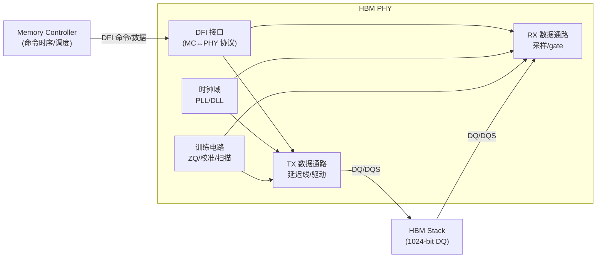

---
tags:
  - HBM
  - PHY
  - 内存架构
  - 半导体
created: 2026-08-14
updated: 2026-08-14
---

# PHY：HBM 物理层

> PHY 承担内存控制器（逻辑）与 HBM 引脚（物理）之间的接口功能：时钟生成、数据通路校准、信号驱动与接收。**training 是 PHY 的核心功能**。
>
> 相关笔记：[[IO]] · [[Training：校准与训练全流程]] · [[固件启动全流程]] · [[从总线访问到PA]]

---

## 一、PHY 在系统中的位置

---

## 二、PHY 的四大职责

### 2.1 时钟生成与管理

| 组件 | 作用 | 关键点 |
|------|------|--------|
| PLL | 把参考时钟倍频到接口频率 | 需要 lock 时间，锁定前不能解复位（[[固件启动全流程]]） |
| DLL | 延迟锁定，产生相位对齐的采样时钟 | 相位步进粒度决定训练精度 |
| 时钟树 | 分发到所有 IO | 偏斜（skew）要尽量小 |

### 2.2 数据通路（TX/RX）

- **TX（写方向）**：MC 数据 → 延迟线（per-pin 可调）→ 驱动器（强度/阻抗可配）→ DQ。
- **RX（读方向）**：DQ → 接收器（端接/均衡）→ 采样器（用 DQS 派生的时钟）→ 延迟对齐 → MC。
- 每个 pin 的延迟线（delay line）是 training 的实现载体——训练结果即这些延迟线的设置值。

### 2.3 训练电路（Calibration）

- **ZQ 校准**：参考 240Ω 外阻，校准驱动器/ODT 阻抗（详见 [[Training：校准与训练全流程]]）。
- **DQS/DQ 训练**：per-pin 延迟扫描、相位调整。
- **Loopback / BIST**：片上环回自测，用于量产与调试（HBM 厂商的 BIST 位于 base die/测试端，SoC 的 loopback 位于 PHY 侧，两者配合）。

### 2.4 DFI 接口（与 MC 的协议）

- **DFI（DDR PHY Interface）**：MC 与 PHY 之间的标准接口，定义命令/数据/控制/状态通道。
- training 时 MC 通过 DFI 的专用信号（如 `dfi_rdlvl_en`、`dfi_wrlvl_en`、`dfi_ctrl_upd`）控制 PHY 进入各训练模式——**所以 training 是 MC 固件与 PHY 固件协同完成的**。

---

## 三、PHY 固件 vs 硬件分工

| 职责 | 硬件做 | 固件做 |
|------|--------|--------|
| 训练执行 | 延迟线、比较器、扫描电路 | 编排训练流程、判定通过/失败、写回结果 |
| 时序表 | — | 从 JEDEC/固件表填 MC 时序寄存器 |
| 故障诊断 | 状态寄存器 | 读取快照、降级决策、上报 |
| 重训练 | 后台训练电路（若有） | 触发时机与策略（温度/QoS） |

> **要点**：训练逻辑由"硬件电路 + 固件编排"共同实现——逐 bit 扫描延迟线属微秒~毫秒级操作，由硬件执行；训练时机、失败处理与结果应用属策略，由固件编排。

---

## 四、PHY 与 HBM 的物理边界

- PHY 的 DQ/DQS 引脚通过 **interposer 走线 → μbump → TSV** 到达 HBM 的 base die（见 [[IO]]）。
- 走线长度的差异（TSV 深度、μbump 位置）直接造成 pin-to-pin 偏移 → 这正是 training 要补偿的东西。
- HBM4 方向：**base die 逻辑化**，部分 PHY/训练相关电路可能下沉到 base die——PHY 与 HBM 的边界在演进。

---

## 参考资料

- [DDR PHY Interface (DFI) 规范（DDR PHY 工作组）](https://www.ddr-phy.org/)
- [Synopsys DDR/HBM PHY 产品文档](https://www.synopsys.com/designware-ip/interface-ip/ddr-ip.html)
- [Cadence DDR/HBM PHY 产品文档](https://www.cadence.com/en_US/home/tools/ip/design-ip/ddr-ip.html)
- 关联笔记：[[IO]] · [[Training：校准与训练全流程]] · [[固件启动全流程]] · [[从总线访问到PA]] · [[CGR和PLL]]
