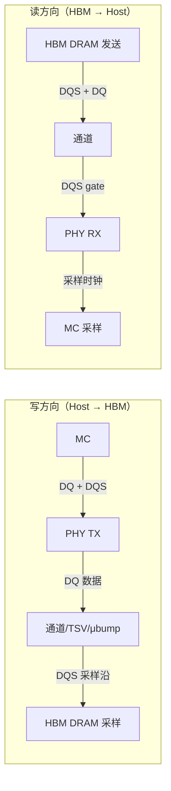
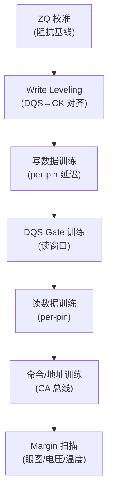
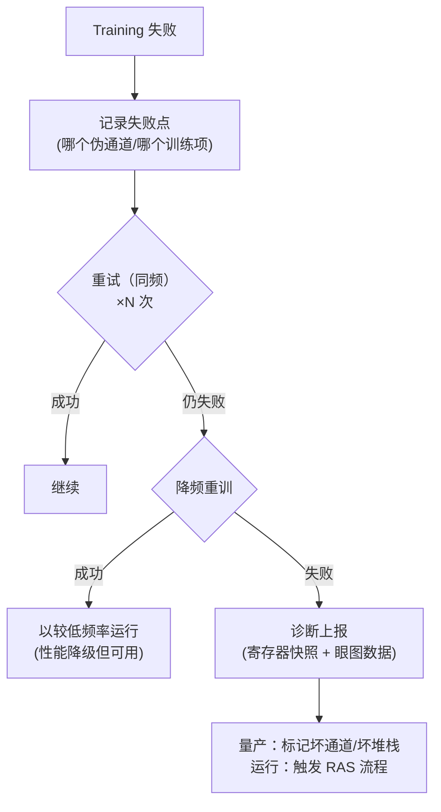

---
tags:
  - HBM
  - Training
  - PHY
  - 固件
  - 内存架构
  - 半导体
created: 2026-08-14
updated: 2026-08-14
---

# Training：校准与训练全流程

> 本文详述 [[固件启动全流程]] 中的 training 阶段。上电后 HBM 各信号引脚存在**工艺（P）、电压（V）、温度（T）** 造成的偏移，training 逐 pin 校准这些偏移，使数据在正确的时刻被采样。固件工程师需掌握：**训练的对象、训练的必要性、训练失败的处理策略**。

---

## 一、为什么需要 Training？

### 1.1 PVT 偏移来源

| 偏移来源 | 说明 | 量级（示意） |
|---------|------|-------------|
| 工艺（Process） | 每颗 die、每条走线的 RC 延迟不同 | ±几十 ps ~ 上百 ps |
| 电压（Voltage） | IR drop、供电波动改变驱动/接收速度 | 数十 ps/V |
| 温度（Temperature） | 载流子迁移率变化 → 延迟变化 | 高温变慢 |
| 封装/PCB | TSV、μbump、interposer、基板走线长度差 | 数百 ps 量级（HBM 尤其显著） |

**HBM 比普通 DDR 更依赖 training**：信号要走 TSV + μbump + interposer + substrate，路径长且异构，pin-to-pin 偏移大；同时接口速率高（HBM3E 9.6Gbps，一个 UI 约 104ps），数据有效窗口（眼图）窄，稍不对齐就采错。

### 1.2 Training 的本质

```
目标：让 DQS 边沿落在数据眼图正中间（写方向）
      让采样时钟落在读数据眼图正中间（读方向）
手段：对每个 pin/每个字节通道的延迟做精细调整（delay line / 相位步进）
度量：训练后跑 margin 扫描，验证眼图宽度/高度
```



---

## 二、训练类型全景

一次完整的 HBM training 按依赖顺序排列：



### 2.1 ZQ 校准（阻抗校准）——一切训练的基础

**原理**：DRAM 外部接一个精确的参考电阻（典型 **240Ω，ZQ 引脚**），DRAM 内部把可调阻抗/端接校准到与参考电阻一致，得到校准码（code），再把这个码复制到所有 IO 的驱动器和 ODT。

```
外部 240Ω ── ZQ 引脚 ──▶ DRAM 内部比较器 ── 校准码(code) ──▶ DQ 驱动强度 / ODT
```

| 命令 | 全称 | 用途 |
|------|------|------|
| ZQCL | ZQ Calibration Long | 上电/长时间漂移后的完整校准（耗时较长） |
| ZQCS | ZQ Calibration Short | 运行中快速补偿（温度漂移） |

**为什么先做 ZQ**：驱动强度/端接不正确 → 信号摆幅、反射都错 → 后面的 timing training 没有意义。**信号完整性（SI）是 timing 的前提。**

### 2.2 Write Leveling（写电平校准）

**问题**：DRAM 内部的 DLL 能保证 DQS 与内部时钟对齐，但**外部 DQS 与 CK 的到达时间差**（来自 PCB/封装/PHY）无法由 DRAM 自行消除。写数据时 DRAM 用 DQS 采样 DQ，而命令用 CK——两者必须对齐。

**做法**：
1. MC 发写 leveling 使能（MR 编程），DRAM 进入 leveling 模式：此时 DRAM 的 DQ 会反馈 CK 的状态。
2. MC 不断推迟 DQS 的相位，直到在 DQ 上观察到 CK 边沿翻转 → 记录该延迟。
3. 该延迟值 = DQS 相对 CK 的偏移量，写入 PHY 寄存器。

> **要点**：Write Leveling 校准 DQS 相对 CK 的到达时间偏移。

**实现机制（HBM 公开 PHY 行为模型，JESD238 口径）**：
- DRAM 通过 **MR readback** 回报 DQS 与 CK 的相位关系（超前/滞后）。
- PHY 递增写选通延迟码 `wdqs_delay[4:0]`（5 位抽头，0-31 档，每档半个 UI）直至对齐；按字节组（per-byte）调整。
- 例：8 Gbps 时 1 UI = 125 ps，31 档覆盖约 1.9 ns 对齐范围，足以覆盖硅中介层走线偏差。

### 2.3 写数据训练（Write Data Training）

每个 DQ pin 的走线延迟不同 → 在 DQS 采样沿位置，逐个 pin 微调写延迟，使所有 DQ 的数据眼图中心对齐 DQS 边沿。

**方法**：写已知 pattern（如 0/1 交替、PRBS）→ DRAM 读回（或用环回）→ 比较 → 调整该 pin 延迟 → 迭代。

### 2.4 DQS Gate 训练（读侧）

**问题**：读操作时 DQS 是 **DRAM 发起的脉冲（读 burst 时才有）**，PHY 需要用 gate 信号圈住有效 DQS 窗口，否则空闲时的 DQS 噪声会被误当数据时钟。

**做法**：扫描 gate 延迟，找到"DQS 有效脉冲恰好落在 gate 窗口内"的最佳点。这是读侧最容易失败、也最受温度影响的训练项。

### 2.5 读数据训练

与写训练对称：读回数据时，PHY 的采样时钟必须对准 DRAM 返回的 DQS 与 DQ。逐 pin 调整采样延迟，直到读回 pattern 全对。

### 2.6 命令/地址（CA）训练

命令/地址总线同样存在延迟偏移。CA 通常比 DQ 低速率（命令率），但高频率下依然需要校准（部分平台通过 PHY 的 CA delay line 微调）。

### 2.7 Margin 扫描（收尾验证）

训练完成后做**眼图扫描**：在最佳点前后扫延迟，测量左/右 margin（以及电压方向的高/低 margin）。输出一张"眼图报告"：

```
          ←── left margin ──→ ◄●► ←── right margin ──→
    采样点    |████████████████|●|████████████████|
              └──────── 数据眼图 ────────┘
```

- margin 大 → 抗 PVT 漂移能力强，量产通过率高
- margin 小 → 需降频/检查 SI（阻抗、串扰、电源噪声）

---

## 三、HBM 特有的训练考量

| 特性 | 对训练的影响 |
|------|-------------|
| **Pseudo Channel（伪通道）** | HBM3E 每个 64-bit 通道拆成 2×32-bit 伪通道（共 32 个），**训练必须覆盖每个伪通道**，并行训练可缩短时间 |
| **1024/2048-bit 超宽总线** | pin 数量巨大 → 训练时间与覆盖率管理是工程重点（并行度、pattern 效率） |
| **堆叠/TSV/μbump** | 每层的 TSV 延迟不同 → 按伪通道独立校准；TSV 冗余（redundancy）启用会影响路径延迟 |
| **Base Die（HBM4 逻辑化）** | Base die 承担更多控制逻辑，训练电路可能部分下沉到 base die（HBM4 演进方向） |
| **热（高温）** | 温度升高 → 训练结果漂移 → 需要运行期监控/重训练 |

### 3.1 训练的执行者：硬件训练引擎与平台固件

- **HBM2 起内置硬件训练引擎（Hardware Training Engine）**：训练由硬件自动完成，区别于 DDR 的控制器软件驱动式训练。
- **NVIDIA Grace Blackwell**：HBM training 从 UEFI 固件移出，改由系统 boot 流程执行以缩短启动时间；vfio 驱动轮询 BAR0 状态寄存器（`HBM_TRAINING_BAR0_OFFSET=0x200BC`，就绪值 0xFF，总超时 30s）确认训练完成，未完成则禁止 device passthrough（BAR 机制见 [[PCIe：Host 与 NPU 的连接]]）。
- **AMD**：memory training 由 PSP（Platform Security Processor）固件执行，需在 VRAM 保留训练内存区（TMR）；驱动负责保留与校验训练数据区。
- **JESD238 上电序列参考（PHY 行为模型，周期数）**：RESET(200) → POWER_STABLE(100) → ZQ_LONG(512，ZQCL) → WR_LEVELING(64) → RD_CENTERING(64) → NORMAL（`phy_init_done` 后控制器方可下发命令），总计约 940 周期。

---

## 四、Training 失败的处理（固件工程师的核心工程能力）



**工程要点**：
1. **可诊断性**：失败时必须能导出"哪条通道、哪个训练项、什么 phase"的寄存器快照——HBM 厂商与 SoC 客户联合调试就靠这个。
2. **降级策略**：部分通道失败 → 关闭该伪通道（容量/带宽降级）vs 全栈降频，按产品策略选择。
3. **与 DFT/BIST 的关系**：量产测试（HBM 厂商侧）用 BIST 预先筛掉坏堆栈；系统级 training 失败说明堆栈在系统环境（时序/电源）下有问题。
4. **HBM 修复机制**：TSV/行冗余（redundancy）、PPR（Post Package Repair，DDR 有 soft/hard PPR，HBM 相关机制在标准中定义）——修复后需要**重训**。

---

## 五、运行期：温度漂移与重训练

- 训练结果是"某温度点的最优解"；运行中温度变化（HBM 在高负载下升温明显）会移动眼图。
- 应对手段：
  - **周期性 margin 监控**（部分 PHY 支持后台训练）
  - **温度触发重训练**（先进入安全频率 → 重训 → 恢复）
  - **刷新率调整**（高温用 1x/2x 刷新，配合 [[固件启动全流程]] 的 tREFI 配置）
- 重训练期间内存访问会被阻塞/降速 → 需要和系统调度协商（QoS）。

---

## 参考资料

- [[固件启动全流程]]（training 在启动流程中的位置）
- [[PHY]]（训练电路所在的物理层）
- [[IO]]（DQ/DQS 物理接口）
- [[HBM和DDR]]（HBM 与 DDR 训练差异）
- JEDEC HBM 标准（JEDEC JESD235 系列：HBM2E/HBM3/HBM3E）— 训练命令与 MR 定义的权威来源：[jedec.org](https://www.jedec.org/)
- [EcrioniX HBM3 PHY 行为模型（JESD238 上电序列与训练寄存器细节）](https://ecrionix.org/hbm3-controller/phy-model/)
- [Synopsys HBM3 IP 技术文章（时钟架构、on-die ECC、伪通道）](https://www.synopsys.com/zh-cn/designware-ip/technical-bulletin/hbm3-ip-dwtb.html)
- [NVIDIA vfio nvgrace-gpu HBM training 检查补丁（Linux 内核，2025-01 合入）](https://marc.info/?l=linux-kernel&m=173715687019284&w=4)
- [AMD amdgpu memory training 保留区补丁（PSP 固件执行）](https://lists.freedesktop.org/archives/amd-gfx/2026-March/141684.html)
- DDR PHY training 公开资料：Synopsys/Cadence DDR PHY 产品文档（write leveling、DQS gate 等概念的行业通用表述）
- [SK hynix HBM3E 产品页](https://product.skhynix.com/products/dram/hbm/hbm3e.go?appTypCd=APX01&treeNo=1116)
