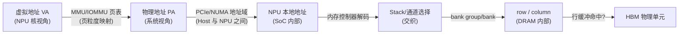

---
tags:
  - HBM
  - 内存架构
  - 地址映射
  - NPU
created: 2026-08-14
updated: 2026-08-14
---

# 从总线访问到 PA：访存地址的变换路径

> NPU 核发出一次访存，最终命中 HBM 中某个**通道、bank、row、column** 的物理单元。各级地址变换决定性能（交织）、错误定位（伪通道粒度）与固件/驱动的职责边界。
>
> 相关笔记：[[IO]] · [[PHY]] · [[固件启动全流程]] · [[内核内存错误处理（CE与UCE）]] · [[BIOS和UEFI]]

---

## 一、地址变换总览



> 从 HBM 厂商视角：固件职责集中于最后两级寻址（通道/伪通道 → bank → row/col），前几级属于 SoC/系统实现——该分工是理解系统职责边界的关键。

---

## 二、各级地址的角色

### 2.1 虚拟地址 → 物理地址（MMU/IOMMU）

- **CPU/NPU 核**访问的是虚拟地址，由页表翻译成物理地址。
- NPU 常有自己的 **IOMMU/SMMU**（对 DMA 场景）或与 CPU 共享地址空间（统一内存）。翻译粒度是页（典型 4KB/2MB/1GB）。
- 对内存系统透明：控制器只看到物理地址。

### 2.2 物理地址 → 通道/堆栈（交织 Interleaving）

这是**性能关键**。多通道/多堆栈的物理地址要做**交织**，让连续地址**均匀撒到所有通道**：

```
不交织（坏）：
  PA 0x0000-0x3FFF → 通道 0；0x4000-0x7FFF → 通道 1
  → 顺序访问永远打满一个通道，其余空闲

交织（好）——地址低位选通道：
  通道 = PA[6:4]（粒度 64B，一个 cache line）
  → 连续访问轮流命中 16 个通道（HBM3E）→ 带宽叠加
```

| 交织参数 | 含义 | 典型值 |
|---------|------|--------|
| 交织粒度（stride） | 多少地址切换一次通道 | cache line（64B）到 KB 级 |
| 交织位数 | 参与通道选择的地址位 | 低位（如 [7:6] 选 4 通道） |
| 伪通道交织 | 在 64-bit 通道内再拆（HBM3E） | 32 伪通道 × 32-bit |

> **要点**：交织粒度需权衡——过小则单次访问跨通道开销大，过大则通道负载不均；64B（cache line）粒度是常见折中。

### 2.3 通道内：bank group → bank → row → column

地址解码在控制器内逐级展开：

```
PA ──▶ Stack 选择 ──▶ Channel/Pseudo Channel ──▶ Bank Group ──▶ Bank
   ──▶ Row（行，activate 打开）──▶ Column（列，read/write 取数据）
```

- **Bank**：DRAM 内部独立工作的小阵列，多个 bank 并行隐藏延迟（一个 bank 在 precharge 时另一个能 activate）。
- **Row Buffer**：行被 activate 后驻留在 row buffer，**行命中（row hit）**时直接列访问，延迟大幅降低——这是决定 DRAM 实际性能的关键因素（见 [[带宽和频率]] 里的随机 vs 顺序访问）。

---

## 三、错误定位与地址的关联（RAS 视角）

- 内存错误上报时，硬件给出的是**物理地址 + 通道/伪通道信息**（见 [[内核内存错误处理（CE与UCE）]]）。
- 交织让"物理地址 → 具体伪通道"的对应关系复杂：同一伪通道的页分散在地址空间各处 → 隔离策略（下线一个伪通道 vs 下线散落的页）需要权衡。
- HBM 厂商提供的 **通道/伪通道级错误统计**（如某伪通道 CE 率异常）是预测性维护的关键输入。

---

## 四、上下游衔接

```
上游：BIOS/UEFI（Host 侧）经 PCIe 把 NPU 的 MMIO/显存 BAR 映射进系统地址空间
      → 见 [[BIOS和UEFI]] 与 [[PCIe：Host 与 NPU 的连接]]
中游：NPU 固件初始化 MC 的地址映射/交织寄存器（初始化时静态配置）
      → 见 [[固件启动全流程]]
下游：HBM 物理寻址（stack/channel/bank/row/col）
      → 见 [[IO]]（接口）和 [[PHY]]（物理层）
```

- 地址映射寄存器（交织表、通道使能掩码）在固件启动阶段配置，**训练完成后才能最终生效**——因为训练失败的伪通道可能要被屏蔽，映射表要相应调整。

---

## 参考资料

- [Memory interleaving（Wikipedia）](https://en.wikipedia.org/wiki/Memory_interleaving)
- [DRAM 层级寻址（Micron 技术文档）](https://www.micron.com/-/media/client/global/documents/products/technical-note/dram/tn-04-05-dram-address.pdf)
- [Memory hierarchy and row buffer（Lecture notes, e.g. UC Berkeley CS152）](https://people.eecs.berkeley.edu/~kubitron/courses/cs152-S12/lectures/)
- 关联笔记：[[IO]] · [[PHY]] · [[固件启动全流程]] · [[内核内存错误处理（CE与UCE）]] · [[BIOS和UEFI]]
