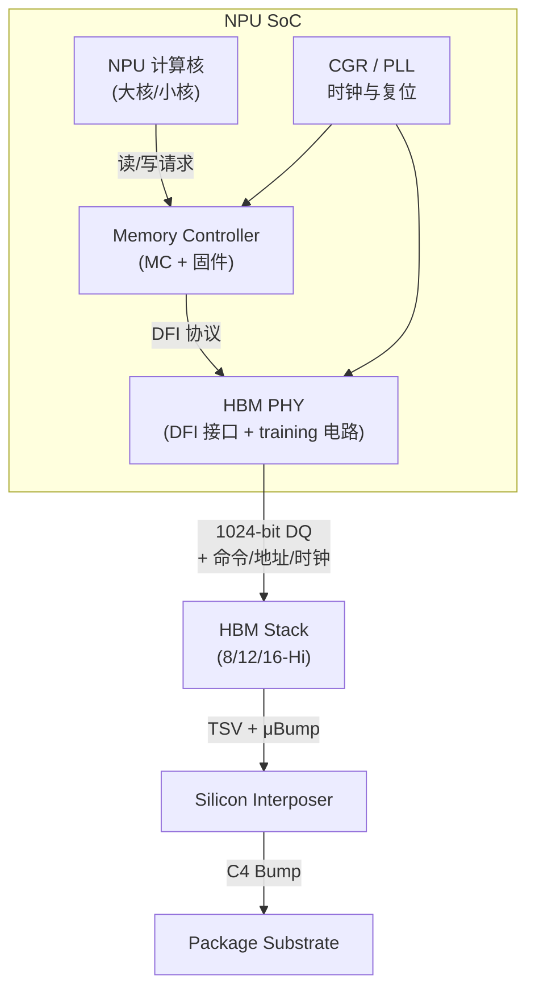
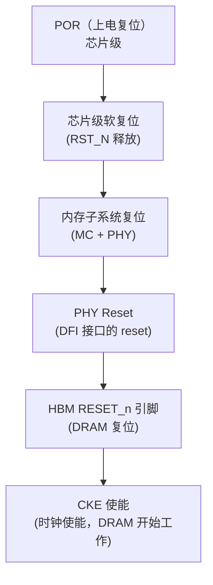
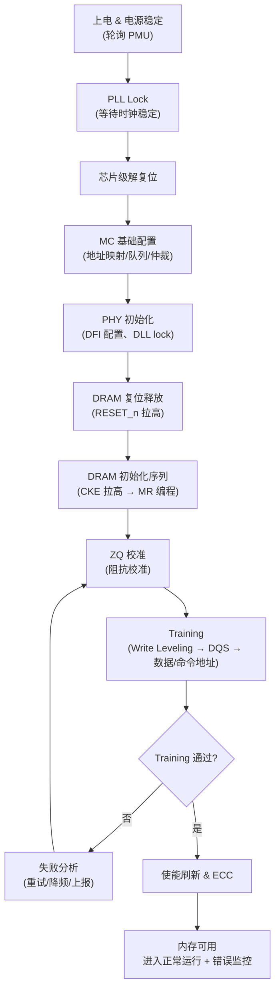

---
tags:
  - HBM
  - 固件
  - NPU
  - 内存架构
  - 半导体
created: 2026-08-14
updated: 2026-08-14
---

# HBM 固件启动全流程：初始化 → 解复位 → 寄存器配置 → Training

> 本文以 **HBM 制造厂商底层软件工程师** 视角写作。HBM 堆叠集成于 NPU/GPU 的 SoC 封装内，其从上电到可用的初始化过程由内存子系统固件完成。本文记录 **NPU 启动时，内存子系统固件（Memory Controller Firmware + PHY Firmware）完成 HBM 初始化的全过程**——初始化、解复位、寄存器配置、training。
>
> 相关笔记：[[PHY]] · [[IO]] · [[从总线访问到PA]] · [[HBM和DDR]] · [[CGR和PLL]] · [[BIOS和UEFI]] · [[纠错算法（ecc、RS）和symbol]] · [[内核内存错误处理（CE与UCE）]]

---

## 一、概述：HBM 固件在 NPU 里的位置与职责

### 1.1 初始化过程概述

NPU 上电后，内存子系统对外呈现为"可用"状态之前，需依次完成电源稳定、时钟稳定、解复位、控制器与 PHY 配置、HBM DRAM 初始化与 training：

```
上电 → 电源稳定 → 时钟稳定 → 解复位 → 控制器/PHY 配置 → HBM DRAM 初始化
     → Training（校准）→ ECC/刷新使能 → 内存可用 → 错误监控
```

时序不满足（例如 training 时频率尚未锁定、解复位顺序颠倒）会导致 training 失败重试，严重时损坏 HBM 或整机无法启动。

### 1.2 固件职责分工

| 角色 | 写的固件 | 职责 |
|------|---------|------|
| **HBM 厂商**（我们） | HBM 测试/DFT 固件、Base Die 逻辑固件、training 要求文档、PHY 协同设计规范 | 定义 HBM 的时序/电气/训练需求，提供 BIST/修复能力 |
| **PHY 厂商**（Synopsys/Cadence） | DDR/HBM PHY 的 training 微码 | 数据通路校准（DQS/DQ/ZQ） |
| **SoC/NPU 厂商** | Memory Controller（MC）固件、启动 ROM、FSP 类似物 | 把 PHY training 结果变成控制器配置，管理刷新/ECC/错误上报 |

> HBM 标准定义的时序、电气与训练要求是固件实现的依据——例如 tRFC 随堆叠层数增大、MR 的配置方法、training 必须覆盖所有 pseudo channel。固件工程师需能够直接依据 JEDEC 标准进行实现。

### 1.3 内存子系统全景



- **MC（Memory Controller）**：接受 NPU 核的访存请求，做调度/仲裁，生成 DRAM 命令时序（activate/precharge/read/write/refresh）。
- **PHY**：MC 逻辑信号与物理引脚之间的桥梁，负责时钟生成（DLL/PLL）、DQS 与 DQ 的校准、驱动强度、阻抗匹配，以及**training 电路**。
- **DFI（DDR PHY Interface）**：MC 与 PHY 之间的标准接口协议（类似 AXI 之于总线），training 时 MC 通过 DFI 控制 PHY。

---

## 二、启动前准备：电源、时钟、复位域

### 2.1 电源时序（Power Sequencing）

HBM 是多电源系统，**必须先"有电"才能谈初始化**：

| 电源域 | 作用 | 上电顺序要求 |
|--------|------|-------------|
| VDD | DRAM 核心电源（~1.1V，HBM3E/HBM4 逐渐降到 1.0-1.1V 区间） | 最先 |
| VDDQ | IO 电源（DQ/DQS 驱动） | 与 VDD 基本同时 |
| VDD2 | 命令/地址与内部逻辑电源 | 跟随 |
| VPP | 字线升压电源（编程/刷新用） | 最后 |

> 上电顺序违反的后果：闩锁（latch-up）、漏电增大、训练时 IO 驱动行为异常。HBM 固件在初始化前必须**轮询电源管理单元（PMU）的状态寄存器**，确认所有电源域稳定（通常要求稳定后还要等若干毫秒的"稳定时间"）。

### 2.2 时钟

- HBM 由 SoC 侧提供**参考时钟**（RefClk，通常 100MHz 级别），PHY 内的 **PLL** 将其倍频到 DDR 接口频率（如 HBM3E 的 9.6Gbps 数据率 → 命令时钟 ~2.4-4.8GHz 区间）。
- 固件在解复位前必须等待 **PLL Lock**（锁定时间典型几百 µs 到 ms 级），否则复位信号在未稳定的时钟下传播会引入亚稳态。
- 时钟树相关细节见 [[CGR和PLL]]。

### 2.3 复位域（Reset Domains）

NPU 里的复位是**分层的**，解复位必须由粗到细：



各复位信号的角色：

| 复位信号 | 所属域 | 解复位后固件要做什么 |
|---------|--------|-------------------|
| POR_n / RST_N | 芯片级 | 等待电源稳定、PLL lock |
| MC 复位 | 控制器 | 配置 MC 基础寄存器（地址映射、burst 长度） |
| PHY Reset（DFI） | PHY | 初始化 PHY 寄存器、等待 DLL lock |
| HBM RESET_n | DRAM | 执行 DRAM 初始化序列（下文） |
| CKE | DRAM | 拉高 CKE 前必须先完成 MR 编程，且时钟必须稳定 |

### 2.4 解复位顺序的"为什么"

1. **先解 SoC 侧复位**：因为 MC/PHY 的配置寄存器本身需要时钟才能写入。
2. **PHY 的 DLL/PLL 要先于 DRAM 复位释放**：DRAM 的 RESET_n 释放后，HBM 需要**有效的命令时钟**才能完成初始化；命令时钟来自 PHY。
3. **CKE 最后拉高**：CKE 是高电平期间 DRAM 开始接受命令；在此之前所有 MR（Mode Register）必须写完，否则 DRAM 会以默认（错误）配置开始工作。
4. **Training 必须在 DRAM 能响应命令之后**：即 CKE 拉高 → 完成基本 MR 编程 → 先做 ZQ/电平类校准 → 再做数据通路 training。

> **要点**：解复位顺序"时钟 → 控制器 → PHY → DRAM → CKE"由各层依赖关系决定：寄存器写入需时钟、DRAM 初始化需命令时钟、training 需 DRAM 可应答。

---

## 三、初始化流程总览



关键点：**Training 是初始化中最长、最容易失败的阶段**（详见 [[Training：校准与训练全流程]]），固件必须设计重试与降级路径（如降频重训、关闭某些 margin 测试）。

---

## 四、寄存器配置（Register Configuration）

### 4.1 三类寄存器

| 类型 | 写入方 | 内容 | 例子 |
|------|------|------|------|
| **MC 时序寄存器** | MC 固件 | DRAM 时序参数、调度策略 | tCK、tRCD、tRP、tRFC、tFAW、tREFI、burst 长度 |
| **PHY 寄存器** | PHY 固件 | IO 配置、校准结果、时钟 | 驱动强度、ODT、DLL 相位、ZQ 结果 |
| **HBM Mode Register（MR）** | MC 通过命令写入 | DRAM 行为配置 | 突发长度、CAS/写延迟、刷新模式、ZQ、TSV/ECC 相关 |

### 4.2 MC 时序参数（来自 JEDEC HBM 标准，典型值）

固件要把 HBM 标准里的 AC 时序表填进控制器。这些值**随代际和频率变化**，正确填写是 training 通过的前提：

| 参数 | 含义 | 典型值（HBM3E @ 高频率，示意） | 为什么重要 |
|------|------|------------------------------|-----------|
| tCK | 命令时钟周期 | ~0.208ns（4.8GHz，示意） | 所有时序的基准单位 |
| tRCD | RAS 到 CAS 延迟 | 十几 ns 量级 | activate→列命令的间隔 |
| tRP | 预充电时间 | 十几 ns | 行关闭→再激活 |
| tRFC | 刷新周期时间 | 数百 ns（随堆叠层数增大！） | 全栈刷新耗时，**HBM 因为堆叠所以 tRFC 比 DDR 大** |
| tREFI | 刷新间隔 | ~7.8µs（温度相关，高温缩短） | 数据保持的根本保障 |
| tFAW | 四银行窗口 | 几十 ns | 突发激活限流 |
| tWTR / tRTW | 写读/读写转换 | 几 ns | 总线方向切换代价 |
| tCCD | 列到列延迟 | 几 ns | 背靠背读写节拍 |

> **HBM 与 DDR 的差异**：HBM 堆叠层数多 → 每层都要刷新 → **tRFC 显著更大**；同时 HBM 的 bank 数量多、pseudo channel 并行度高 → 调度窗口更宽，MC 需要更多队列。

### 4.3 HBM Mode Register（类比 DDR 的 MR0-MR6，HBM 有更多）

固件通过 **MRW（Mode Register Write）命令** 配置 DRAM：

```
// 伪代码示意：配置突发长度与 CAS 延迟
mrw(MR0,  { BL: 8, CL: 0b0110 });   // 突发长度、CAS 延迟选择
mrw(MR1,  { WR: 0b010 });            // 写恢复时间
mrw(MR2,  { CWL: 0b010 });           // CAS 写延迟
mrw(MR3,  { REF_MODE: 0b01 });       // 刷新模式（all-bank / per-bank）
mrw(MR4,  { ZQ: 0b01 });             // ZQ 校准相关
mrw(MR10, { ... });                  // HBM 特有：TSV/伪通道/温度相关配置
```

典型编程顺序：
1. **MR0/MR1**：基础时序（CL、CWL、BL）——必须在 CKE 拉高后的初始化序列里尽早写。
2. **MR3/MR4**：刷新与 ZQ。
3. **HBM 特有 MR**：pseudo channel 使能、TSV 冗余（redundancy）启用、ECC 相关（若 base die 支持 on-die ECC）。
4. Training 相关 MR：写 leveling 使能等（在 training 阶段动态配置，见 [[Training：校准与训练全流程]]）。

### 4.4 PHY 寄存器配置

- **阻抗/驱动**：DQ/DQS 的驱动强度（drive strength）与 ODT（片上端接）值，由 **ZQ 校准结果**决定——PHY 把校准码写回 IO 寄存器。
- **时钟**：DLL 相位步进、PLL 分频比。
- **training 结果**：per-pin 的延迟/相位补偿值（training 完成后写回，形成"训练表"）。

---

## 五、Training 在启动流程中的位置

Training 是初始化中耗时最长、失败率最高的阶段：上电后的时序偏移（PVT：工艺/电压/温度变化）导致每个 pin 的延迟都不同，必须**逐 pin 校准**。

**Training 依赖链**（必须在 DRAM 可响应命令后）：

```
ZQ 校准（电气基线）→ Write Leveling（DQS 对齐 CK）→ 写训练 → 读训练（DQS gate）
→ 命令/地址训练 → 数据眼图 margin 测试 → 结果写回 PHY 寄存器
```

**训练执行者**：HBM2 起由片上**硬件训练引擎**自动执行，或由平台固件编排（NVIDIA Blackwell 已将训练移出 UEFI 由 boot 流程执行、AMD 由 PSP 固件执行），详见 [[Training：校准与训练全流程]] §3.1。

完整细节见独立笔记：[[Training：校准与训练全流程]]。固件设计上要记住三个原则：
1. **Training 结果必须持久化**（写回寄存器 + 可导出供量产/调试分析）。
2. **失败要可重试**（先重试同频，再降频，最后报错并进入可诊断状态）。
3. **温度漂移**：运行中温度变化会移动训练好的 margin，所以正常模式还有**周期性/事件触发的重训练或 margin 监控**（部分 PHY 支持）。

---

## 六、进入正常模式与持续监控

Training 通过后，固件需启用全部可靠性保障机制：

| 机制 | 作用 | 对应笔记 |
|------|------|---------|
| 刷新（Refresh） | 数据保持，DRAM 必须持续刷新 | — |
| **ECC 使能** | 内联 ECC / on-die ECC，纠正位错误 | [[纠错算法（ecc、RS）和symbol]] |
| 错误上报使能 | CE/UCE 上报通路打开 | [[内核内存错误处理（CE与UCE）]] |
| 温度监控 | 高温会加速数据丢失、缩短刷新间隔 | [[HBM和DDR]] |
| 重训练/边际监控 | 对抗 PVT 漂移 | [[Training：校准与训练全流程]] |

初始化完成 → 固件把内存子系统"交还"给主系统（host），之后 HBM 的错误（CE/UCE）通过中断/APEI 等路径上报给内核处理。

---

## 七、上下游关系

```
BIOS/UEFI（Host 侧）── 配置 PCIe/NPU 的电源与 BAR（[[PCIe：Host 与 NPU 的连接]]）──▶ NPU 固件（本文）
NPU 固件 ── HBM 初始化 + training ──▶ HBM Stack
NPU 固件 ── CE/UCE 上报 ──▶ 内核（EDAC/MCE/APEI）──▶ 隔离/修复
```

- **上游（Host）**：在服务器场景，CPU 侧的 [[BIOS和UEFI]] 负责枚举 PCIe 设备、分配资源、把 NPU 的 MMIO 空间映射出来；NPU 自己的内存子系统固件（本文）是**在 host 看来"板卡内部"的事**，但 host 的 ACPI 表（HEST/GHES）会声明 NPU 的错误上报通道。
- **下游（HBM 硅）**：HBM 标准定义的时序/训练要求是 NPU 固件必须满足的实现约束，固件工程师需能够依据 JEDEC 标准进行实现。
- **错误处理闭环**：NPU 启动时的初始化质量直接决定运行期错误率；运行期错误由内核处理（见 [[内核内存错误处理（CE与UCE）]]）。

---

## 参考资料

- [SK hynix HBM3E 官方产品页](https://product.skhynix.com/products/dram/hbm/hbm3e.go?appTypCd=APX01&treeNo=1116)
- [HBM4 - 全球首款 HBM4 芯片开始量产（澎湃新闻）](https://www.thepaper.cn/newsDetail_forward_31601774)
- [SK Hynix manufactures HBM4 stacks with over 2 TByte/s in series production（heise）](https://www.heise.de/en/news/SK-Hynix-manufactures-HBM4-stacks-with-over-2-TByte-s-in-series-production-10643852.html)
- [Stack memory with 36 GByte per chip: HBM4 mass production from October 2025（heise）](https://www.heise.de/en/news/Stack-memory-with-36-GByte-per-chip-HBM4-mass-production-from-October-2025-10419701.html)
- [JEDEC HBM 标准（jedec.org）](https://www.jedec.org/)
- [HBM3E vs HBM4 Comparison（moz-electronics）](https://mozelectronics.com/tutorials/hbm3e-vs-hbm4-comparison/)
- 关联笔记：[[PHY]] · [[IO]] · [[从总线访问到PA]] · [[Training：校准与训练全流程]] · [[内核内存错误处理（CE与UCE）]]
