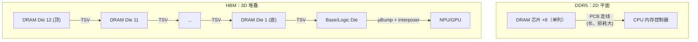

---
tags:
  - HBM
  - DDR
  - 内存架构
  - 半导体
created: 2026-08-14
updated: 2026-08-14
---

# HBM 和 DDR

> 两者同属 DRAM 技术：DDR 面向通用计算主存场景，HBM 面向 NPU/GPU 的近封装高带宽场景。本文对比二者的架构、接口、性能与适用场景，说明 AI 芯片采用 HBM 的原因。
>
> 相关笔记：[[DRAM、SRAM、FLASH]] · [[IO]] · [[PHY]] · [[固件启动全流程]] · [[带宽和频率]]

---

## 一、本质相同：都是 DRAM

- 存储单元完全一样（1T1C，见 [[DRAM、SRAM、FLASH]]）：电容 + 刷新 + 读破坏重写。
- 命令集同源：activate/precharge/read/write/refresh、Mode Register（MR）编程、ZQ 校准——所以 HBM 固件的训练/初始化思路和 DDR 一脉相承（见 [[固件启动全流程]]）。

**差别全在"接口和封装"**：DDR 是 2D 平铺 + 窄总线高频率；HBM 是 3D 堆叠 + 超宽总线中频率。

---

## 二、核心差异

| 维度 | DDR5（对比基准） | HBM3E | HBM4（量产初期） |
|------|-----------------|-------|------------------|
| 每颗/每堆栈位宽 | 64-bit（每通道） | **1024-bit** | **2048-bit** |
| 通道结构 | 2×32-bit 子通道 | 16×64-bit 通道（32×32-bit 伪通道） | 32×64-bit 通道（64×32-bit 伪通道） |
| 数据率 | 4.8-8.8 Gbps | 9.6 Gbps | **8 Gb/s（JEDEC JESD270-4 基线）/ 厂商产品 10-13 Gb/s** |
| 每堆栈带宽 | — | **1.2 TB/s** | **2 TB/s（JEDEC 基线）/ 厂商 2.9-3.3 TB/s** |
| 单颗/单堆栈容量 | 单条 8-64GB | 8-36GB（12-Hi） | **最高 64GB（JEDEC，16-Hi）/ 厂商 36-48GB** |
| 封装 | 2D，PCB 走线 | **3D 堆叠 + TSV + interposer** | 3D + **hybrid bonding（SK 12 层混合键合验证完成，2026）** |
| 功耗效率 | 中 | 高（带宽/瓦优势） | 更高 |
| 生态 | 标准 DIMM，任何 CPU | 与 GPU/NPU 绑定（CoWoS 等） | 同上 |

> 数据为 2025-2026 公开资料口径（JEDEC JESD270-4 标准 + 厂商产品），详见文末来源。

### 2.1 带宽怎么算出来的

```
DDR5 单通道：64 bit × 6.4 Gbps ÷ 8 = 51.2 GB/s（双通道 ~102.4 GB/s）
HBM3E 单堆栈：1024 bit × 9.6 Gbps ÷ 8 = 1.2 TB/s
```

**HBM 的带宽优势来自接口宽度而非单 pin 频率**：1024-bit 并行数据总线的总带宽显著高于 64-bit 的 DDR。

### 2.2 物理结构差异



- **DDR**：走线在 PCB 上，距离长、寄生大 → 频率上不去就靠提高信号速率（代价是 SI 工程难）。
- **HBM**：TSV 垂直互联把走线**缩短到微米级** → 信号完整性好，可以用中频率 × 超宽总线堆出带宽；同时把 DRAM 拉近到 NPU 旁边（近存计算理念）。

---

## 三、为什么 AI 需要 HBM 而不是 DDR

| AI 工作负载需求 | DDR 的困境 | HBM 的答案 |
|----------------|-----------|-----------|
| **高带宽需求**（矩阵乘、attention 读权重/中间结果） | 64-bit 总线带宽上限低 | 1024/2048-bit 超宽总线 |
| **功耗敏感**（数据中心电费） | 高频信号 → 功耗高 | 中频率宽总线 → 每 GB/s 功耗更低 |
| **容量与带宽并存** | 容量大但带宽不够 | 12-16 层堆叠 + 每堆栈 1-2 TB/s |
| **多芯片扩展**（多 NPU 共享） | 无法贴近封装 | 多堆栈围绕 NPU 放，interposer 互联 |

> **要点**：DDR 为通用内存，追求兼容性与成本；HBM 为带宽专用内存，针对 AI 访存模式定制。GDDR 介于两者之间（游戏显卡场景，宽总线×中高频率，2D 封装）。

### 3.1 实机配置参考（NVIDIA 数据中心 GPU）

| 型号 | HBM 代际 | 堆栈数 | 容量 | 总带宽 |
|------|---------|--------|------|--------|
| H100 SXM5 | HBM3 | 6 | 80 GB | 3.35 TB/s |
| H200 SXM5 | HBM3E | 6 | 141 GB | 4.8 TB/s |
| B200 | HBM3E | 8 | 192 GB | 8 TB/s |

> 数据来源：SiliconAnalysts 规格数据库（2026）。这些配置直观说明"多堆栈并行"是 HBM 系统带宽的最终来源。

---

## 四、各自的固件/初始化差异（衔接启动流程）

| 环节 | DDR | HBM |
|------|-----|-----|
| 初始化主体 | CPU 侧 MRC/FSP 或 BMC | NPU 内存子系统固件（[[固件启动全流程]]） |
| 训练对象 | 64-bit 通道 × N | 1024/2048-bit（伪通道全覆盖，[[Training：校准与训练全流程]]） |
| tRFC | 单 die，相对小 | **堆叠层数多 → tRFC 显著更大** |
| 刷新 | 常规 all-bank/per-bank | 多层堆叠，刷新管理更复杂 |
| 错误处理 | 主板 ECC 内存（inline ECC） | on-die ECC + inline ECC + 伪通道隔离（[[内核内存错误处理（CE与UCE）]]） |

---

## 参考资料

- [SK hynix HBM3E 官方产品页](https://product.skhynix.com/products/dram/hbm/hbm3e.go?appTypCd=APX01&treeNo=1116)
- [HBM3E vs HBM4 Comparison（moz-electronics）](https://mozelectronics.com/tutorials/hbm3e-vs-hbm4-comparison/)
- [HBM4 - 全球首款 HBM4 芯片开始量产（澎湃新闻）](https://www.thepaper.cn/newsDetail_forward_31601774)
- [SK hynix 展示 16-Hi HBM4：48GB @ 10 GT/s，2048-bit 接口（CES 2026）](https://tech.yahoo.com/computing/articles/sk-hynix-shows-16-hi-114024153.html)
- [SK hynix 完成 12 层混合键合 HBM4 验证（TrendForce，2026-05）](https://www.trendforce.cn/industry-news/semiconductors/20260501-4662.html)
- [JEDEC 发布 HBM4 标准 JESD270-4（2048-bit / 8Gb/s / 2TB/s / 最高 64GB，2025-04）](https://www.jedec.org/news/pressreleases/jedec%C2%AE-and-industry-leaders-collaborate-release-jesd270-4-hbm4-standard-advancing)
- [SiliconAnalysts HBM 规格与定价数据库（含 H100/H200/B200 配置）](https://siliconanalysts.com/data/hbm-pricing)
- [What is HBM?（Rambus）](https://www.rambus.com/memory/hbm/)
- 关联笔记：[[DRAM、SRAM、FLASH]] · [[IO]] · [[PHY]] · [[从总线访问到PA]] · [[固件启动全流程]]
