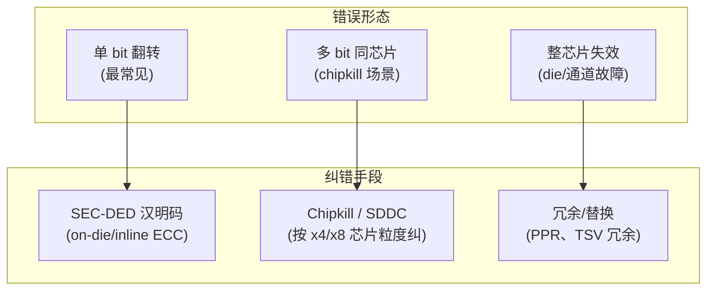

---
tags:
  - 内存架构
  - ECC
  - 纠错算法
  - RAS
  - 半导体
created: 2026-08-14
updated: 2026-08-14
---

# 纠错算法（ECC、RS）和 symbol

> 位翻转在 DRAM 中按一定概率发生，纠错机制用于保障数据可靠性。本文阐述三方面内容：**ECC 的纠错原理（汉明码）、RS 码按 symbol 纠错的机制、以及从 bit 级到芯片级（chipkill）的纠错体系**。
>
> 相关笔记：[[内核内存错误处理（CE与UCE）]] · [[固件启动全流程]] · [[DRAM、SRAM、FLASH]]

---

## 一、为什么需要纠错

- DRAM 单元越来越小、堆叠越来越密 → **位翻转概率上升**（粒子撞击、漏电、行锤击）。
- 一次未纠正的错误位 = 数据损坏 = 计算错误/系统崩溃。
- 纠错的目标：**用冗余位换可靠性**。代价是容量与带宽（ECC 位占额外空间、读写多一次操作）。

```
数据位 + 校验位 ──▶ 编码 ──▶ 存储 ──▶ 读取 ──▶ 解码（检错/纠错）──▶ 正确数据
                      ▲
                错误发生在存储/传输途中
```

---

## 二、汉明码（Hamming Code）与 SEC-DED

### 2.1 奇偶校验不够用

- 1 位奇偶校验：只能**检错**（奇数个错误），不能纠错，也不知道错在哪。
- 汉明码：把数据位分组做奇偶校验，**校验位的位置经过设计**，出错时各校验位的结果组成"错误位置编号"（syndrome 校正子）→ **定位并纠正 1 位错误**。

### 2.2 SEC-DED（Single Error Correct, Double Error Detect）

- 在汉明码基础上再加 1 位总奇偶校验 → 可**纠正 1 位、检测 2 位**。
- 这是现代 ECC 内存的**最低标准**：
  - 64 位数据通常配 8 位 ECC（72-bit DIMM 的由来）。
  - 校验位开销：~12.5%（8/64）。
- 局限：**2 位错误只能检测不能纠正**（会变成 UCE，见 [[内核内存错误处理（CE与UCE）]]）。

```
经典例子（4 数据位 + 3 校验位，Hamming(7,4)）：
  位置:  1   2   3   4   5   6   7
         P1  P2  D1  P4  D2  D3  D4
  P1 覆盖位置 {1,3,5,7}；P2 覆盖 {2,3,6,7}；P4 覆盖 {4,5,6,7}
  出错时 P1/P2/P4 的结果组合 = 出错位置编号 → 取反即可纠正
```

---

## 三、symbol 与 RS 码（Reed-Solomon）

### 3.1 为什么按 symbol 而不是按 bit

- 现实中的错误往往**成串出现**（burst error）：一个坏存储单元/坏引脚/坏芯片 → 连续多个 bit 错。
- 按 bit 纠错（汉明码）对 burst 错误无能为力。
- **symbol（符号）**：把数据按 m 位一组（如 8-bit 一个 symbol）。**一个 symbol 只要错任意 bit，就算"这个 symbol 错"** → 一次能纠正整个 symbol，天然抗 burst。

### 3.2 RS 码原理（GF(2^m) 域上的多项式码）

- 数据看成多项式系数，工作在**伽罗华域 GF(2^m)**（m=8 时一个 symbol 就是 1 字节）。
- 编码：数据多项式 × 生成多项式 → 附加校验 symbol。
- 解码：算**校正子（syndrome）** → 定位错误 symbol 位置（错误定位多项式）→ 求错误值 → 修正。
- 能力：**纠 t 个错误 symbol 需要 2t 个校验 symbol**（同时知道位置和值）；还支持**擦除（erasure）**模式——位置已知时 t 个校验 symbol 可纠 2t 个擦除。

```
RS(255, 223)：255 个 symbol 的码字里 223 个数据 + 32 个校验
→ 可纠正 16 个错误 symbol（t=16），或 32 个擦除
→ 应用：CD/DVD、QR 码、SSD、卫星通信、RAID 6
```

### 3.3 在内存系统里的角色

- 内存主流的 on-die ECC / inline ECC 用**汉明类（SEC-DED）**为主（因为单 bit 翻转是主形态）。
- **RS 类码**更多用在：**SSD 的 LDPC/RS 方案**、**chipkill/SDDC（芯片级纠错）**的某些实现、以及**强纠错需求的链路 ECC（Link ECC）**。

---

## 四、从 bit 到芯片：纠错体系全景



| 手段 | 纠错粒度 | 典型实现 | 代价 |
|------|---------|---------|------|
| On-die ECC | 芯片内部（bit） | DRAM 内部冗余位（如每 128bit 配 8bit） | 芯片面积、对系统透明 |
| Inline ECC（控制器） | 控制器侧（bit/突发） | 服务器内存的标准 ECC（72-bit 总线） | 带宽/容量开销 ~12.5% |
| Chipkill / SDDC | **芯片级**（x4/x8 DRAM 颗粒） | 数据分散到多颗芯片 + 强纠错码 | 地址交织复杂度 |
| PPR / 冗余 | 行/TSV 级（物理修复） | 坏行替换冗余行 | 需固件/测试执行 |

> **Chipkill 思想**：把 72-bit 数据分散到多颗 x4/x8 芯片上，使"一颗芯片完全失效"也只影响每个符号的一部分 → 单颗芯片坏不影响系统。这是数据中心内存 RAS 的关键能力。

---

## 五、HBM 里的 ECC

- **错误率高**：HBM 堆叠密度高 → 默认要求 ECC。HBM 标准支持 on-die ECC（base die 或 DRAM die 内实现），控制器侧也可做 inline ECC。
- **HBM3 的 on-die ECC 具体规格**（Synopsys，JESD238 口径）：**304-bit 码字（272-bit 数据 + 32-bit 校验）**；主机侧每伪通道增加 2 个 ECC 信号；HBM3 完全移除 DM（数据掩码）信号。HBM3 同时引入基于 symbol 的片上 ECC、实时错误报告（每伪通道 2 个 severity 信号：无错误/纠正单个/纠正多个/未纠正）与 ECS（错误检查清理）。
- **两难**：inline ECC 占带宽（读写多一次），on-die ECC 占 die 面积、增加延迟——产品按可靠性与性能权衡。
- **CE 是资源**：可纠正错误被纠正后仍是"信号"，配合 [[内核内存错误处理（CE与UCE）]] 的计数/阈值做**预测性维护**（PREP：predictive failure analysis）。
- **训练/修复联动**：TSV 冗余、PPR 等物理修复后需要重训（见 [[Training：校准与训练全流程]]）。注：HBM 上 PPR 的直接公开应用资料缺失（现有公开专利均为 DDR 侧/通用封装修复）。

---

## 参考资料

- [Hamming code（Wikipedia）](https://en.wikipedia.org/wiki/Hamming_code)
- [Reed–Solomon error correction（Wikipedia）](https://en.wikipedia.org/wiki/Reed%E2%80%93Solomon_error_correction)
- [Chipkill（Wikipedia）](https://en.wikipedia.org/wiki/Chipkill)
- [Error correction code（Wikipedia）](https://en.wikipedia.org/wiki/Error_correction_code)
- [Synopsys HBM3 IP 技术文章（on-die ECC 304-bit 码字规格）](https://www.synopsys.com/zh-cn/designware-ip/technical-bulletin/hbm3-ip-dwtb.html)
- 关联笔记：[[内核内存错误处理（CE与UCE）]] · [[固件启动全流程]] · [[DRAM、SRAM、FLASH]] · [[HBM和DDR]]
