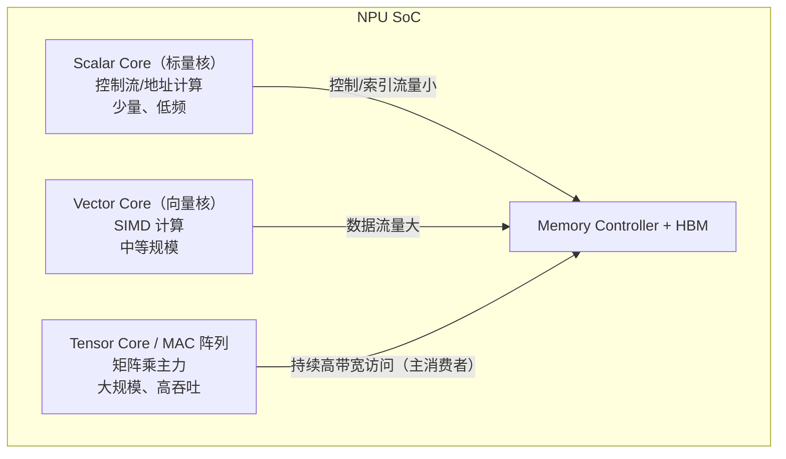

---
tags:
  - 大小核
  - CPU架构
  - NPU
  - 内存架构
created: 2026-08-14
updated: 2026-08-14
---

# 大核与小核：异构计算核与访存模式

> 异构计算核具有不同的访存模式，对内存子系统的带宽与延迟需求不同。本文分析两类异构核——**CPU 的大小核（big.LITTLE / P+E）** 与 **NPU/GPU 的异构计算核（scalar/vector/tensor）**——及其对 HBM 子系统提出的访存要求。
>
> 相关笔记：[[带宽和频率]] · [[从总线访问到PA]] · [[HBM和DDR]] · [[固件启动全流程]]

---

## 一、CPU 大小核：性能与能效的平衡

### 1.1 动机

- 峰值性能与能效是矛盾的：大核快但费电，小核省电但慢。
- 真实负载两种都有：突发重负载（编译、游戏）与轻量常驻（后台、通知）。
- 大小核混合 = **按需供电**：重活上大核，轻活上小核，电池/电费双赢。

| | 大核（P-core / big） | 小核（E-core / LITTLE） |
|---|---|---|
| 定位 | 峰值性能 | 能效 |
| 频率/架构 | 高频、乱序、宽发射 | 低频、有序/窄发射 |
| 典型例子 | Apple Performance、Intel P-core、Cortex-X | Apple Efficiency、Intel E-core、Cortex-A55 |
| 缓存 | 大 L1/L2 | 小 L1/L2 |
| 功耗 | 高 | 低 |

### 1.2 调度：EAS（Energy-Aware Scheduling）

```
任务 → 调度器评估负载与能耗模型
     ├─ 重负载 → 大核（性能优先）
     └─ 轻负载 → 小核（能效优先）
     负载变化 → 任务迁移（migration）跨核
```

- Linux 用 **EAS / EEVDF** 等负载感知调度器，配合 CPUFreq（DVFS）动态调频（[[CGR和PLL]] 的时钟树联动）。
- 任务迁移影响**缓存亲和性（cache affinity）**：迁移 = 缓存失效 = 更多内存访问。

---

## 二、NPU/GPU 的异构计算核

现代 AI 芯片内部也是"大小核混合"：



| 核类型        | 访存特征                 | 对 HBM 的压力              |
| ---------- | -------------------- | ---------------------- |
| 标量核        | 少量随机访问（取指、地址）        | 低延迟敏感                  |
| 向量核        | 规则的大块读写（SIMD）        | 带宽敏感                   |
| 张量核/MAC 阵列 | **持续满带宽流式读写**（权重+激活） | **带宽主导者——HBM 就是为它设计的** |

> **要点**：HBM 带宽是 AI 芯片的关键资源——张量核每时钟周期消费大量权重/激活，带宽不足即算力空转（memory bound）。算力与带宽的匹配（arithmetic intensity / roofline model）是芯片设计的核心权衡。

---

## 三、异构核共存对内存子系统的要求

1. **带宽分配与 QoS**：标量核的延迟敏感请求不能被张量核的持续高带宽访问饿死 → 内存控制器要有**优先级/QoS 机制**（高优先级小请求插队）。
2. **缓存层级协调**：大核大 cache 吸收局部性 → 减少对 HBM 的重复访问；但 cache 一致性（coherence）在异构核间是工程难点。
3. **访存模式识别**：流式（streaming）访问用不同预取策略 vs 随机访问——控制器/固件可以针对性优化（[[从总线访问到PA]]）。
4. **错误处理协同**：多核共享 HBM，一个 UCE 毒化页（[[内核内存错误处理（CE与UCE）]]）可能命中多个核——需要全局协调隔离。

---

## 参考资料

- [big.LITTLE（Arm）](https://www.arm.com/technologies/big-little)
- [Intel Hybrid Architecture（P-core/E-core）](https://www.intel.com/content/www/us/en/architecture-and-technology/12th-gen-core-processors.html)
- [Energy Aware Scheduling (EAS)（kernel.org）](https://docs.kernel.org/scheduler/sched-energy.html)
- [Roofline model（Wikipedia）](https://en.wikipedia.org/wiki/Roofline_model)
- 关联笔记：[[带宽和频率]] · [[从总线访问到PA]] · [[HBM和DDR]] · [[固件启动全流程]] · [[CGR和PLL]]
