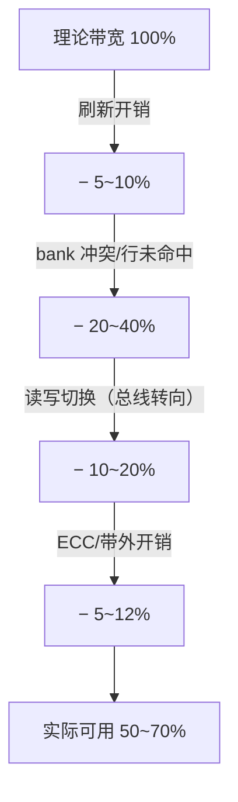

---
tags:
  - 带宽
  - 频率
  - 内存架构
  - HBM
created: 2026-08-14
updated: 2026-08-14
---

# 带宽和频率：内存性能的第一性原理

> 带宽（Bandwidth）与频率（Frequency）是内存性能的基础指标。本文阐述三个公式与一个关键事实：**理论带宽的计算方法、实际带宽低于理论值的原因、HBM 以接口宽度换取带宽的设计思路**。
>
> 相关笔记：[[HBM和DDR]] · [[IO]] · [[从总线访问到PA]] · [[DRAM、SRAM、FLASH]]

---

## 一、核心公式

### 1.1 理论带宽

```
带宽 (GB/s) = 数据位宽 (bit) × 数据率 (Gbps) ÷ 8
```

| 内存 | 位宽 | 数据率 | 理论带宽 |
|------|------|--------|---------|
| DDR5 单通道 | 64-bit | 6.4 Gbps | 51.2 GB/s |
| DDR5 双通道 | 128-bit | 6.4 Gbps | 102.4 GB/s |
| HBM3E 单堆栈 | 1024-bit | 9.6 Gbps | **1.2 TB/s** |
| HBM4 单堆栈 | 2048-bit | 8 Gb/s（JEDEC 基线）/ 厂商 10-13 Gb/s | **2 TB/s（JEDEC）**；厂商 2.9-3.3 TB/s |
| GDDR6X | 32-bit/通道 ×8 | 19-21 Gbps | ~1 TB/s（多通道合计） |

> 注意区分**数据率（Gbps，每 pin）**与**时钟频率（Hz）**：DDR 是双倍数据率（DDR = Double Data Rate，时钟上下沿都传数据），所以 数据率 = 2 × 时钟频率。

### 1.2 带宽的两个杠杆

```
带宽 = 位宽 × 数据率 / 8
        ↑        ↑
       DDR 走宽这条路？   DDR 走高频这条路
       HBM 走这条路！     （SI 难、功耗高）
```

- **高频路线（DDR/GDDR）**：信号完整性（SI）难、功耗高、需要更多端接/均衡。
- **宽总线路线（HBM）**：pin 多、3D 封装支持，中频率 × 超宽 = 低功耗高带宽（[[HBM和DDR]]）。

---

## 二、实际带宽为什么到不了理论值



| 损耗源 | 机理 | 缓解 |
|--------|------|------|
| **刷新（refresh）** | DRAM 必须周期性刷新，占用命令带宽 | 高效刷新调度、伪通道并行刷新 |
| **行未命中（row miss）** | activate/precharge 耗时，行缓冲未命中代价大 | 调度器行命中优化（[[从总线访问到PA]]） |
| **bank 冲突** | 同 bank 背靠背访问互相阻塞 | bank 交织、多 bank 并行 |
| **读写转向** | DQ 总线方向切换需要时间（tWTR/tRTW） | 读写分组调度 |
| **ECC** | inline ECC 多一次读写 | on-die ECC 转移开销 |
| **热/降频** | 高温降频 | 散热设计 |

> **要点**：实际可用带宽约为理论值的 50-70%，需能解释各损耗来源；HBM 的随机访问效率（尤其 AI 的 gather/scatter 模式）是实际性能的关键。

---

## 三、延迟与带宽：两种不同的性能约束

| | 延迟（Latency） | 带宽（Bandwidth） |
|---|---|---|
| 定义 | 一次访问的往返时间 | 单位时间的吞吐 |
| 单位 | ns | GB/s / TB/s |
| 受什么影响 | 物理距离、时序参数（tRCD/tRP）、队列深度 | 位宽、数据率、调度效率 |
| AI 场景 | 单点访存（指针追逐）敏感 | **矩阵乘/注意力（流式大块）敏感** |
| HBM 的定位 | 中（比 DDR 好，比 SRAM 差很多） | **极强（这是 HBM 的卖点）** |

> AI 工作负载主要是带宽敏感（大矩阵流式读写），所以 HBM 的"宽总线"策略精准命中需求；但 latency 敏感的部分（如注意力里的 gather）依然依赖 cache 与调度（[[大核与小核]] 的核结构影响访存模式）。

---

## 四、频率档位与固件的联动

- 内存频率不是随便选的：**每个档位对应一套时序参数与训练结果**（[[固件启动全流程]]、[[Training：校准与训练全流程]]）。
- 运行期 DVFS 调频（[[CGR和PLL]]）→ 需要档位切换协议：先降速 → 重训（或切换预训练好的配置）→ 恢复。
- HBM 厂商视角：**规格书里的带宽是"最高档"数字**；系统实际跑哪个档位，取决于散热、SI margin、固件/驱动策略。

---

## 参考资料

- [HBM3E vs HBM4 Comparison（moz-electronics）](https://mozelectronics.com/tutorials/hbm3e-vs-hbm4-comparison/)
- [SK hynix 展示 16-Hi HBM4：48GB @ 10 GT/s，2.9 TB/s（CES 2026）](https://tech.yahoo.com/computing/articles/sk-hynix-shows-16-hi-114024153.html)
- [Memory bandwidth（Wikipedia）](https://en.wikipedia.org/wiki/Memory_bandwidth)
- [DDR5 规格（JEDEC JESD79-5）](https://www.jedec.org/)
- [SK hynix HBM3E 官方产品页](https://product.skhynix.com/products/dram/hbm/hbm3e.go?appTypCd=APX01&treeNo=1116)
- 关联笔记：[[HBM和DDR]] · [[IO]] · [[从总线访问到PA]] · [[CGR和PLL]] · [[DRAM、SRAM、FLASH]]
