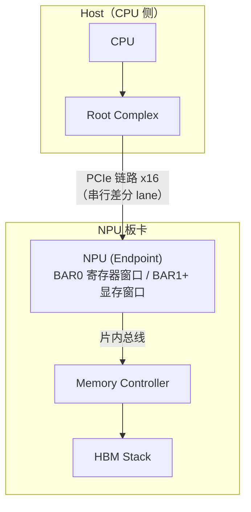
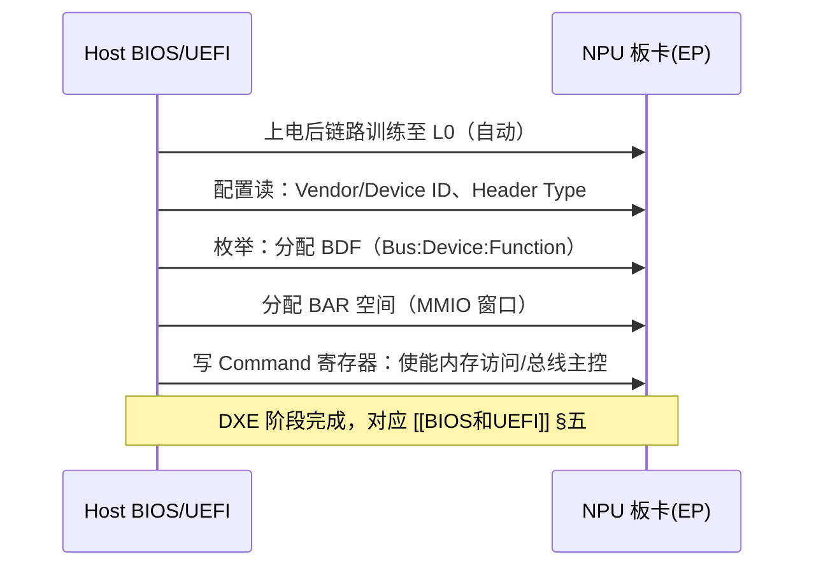
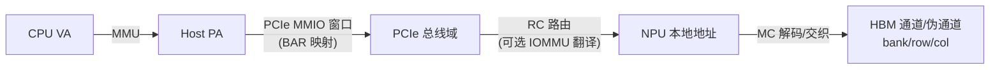

---
tags:
  - PCIe
  - NPU
  - 总线
  - AER
  - RAS
created: 2026-08-15
updated: 2026-08-15
---

# PCIe：Host 与 NPU 的连接

> 本库视角下的 PCIe（Peripheral Component Interconnect Express，PCI-SIG 定义的点对点高速串行总线）就是 **Host 与 NPU 之间的一根线**：Host 经它枚举 NPU、分配 BAR、使能板卡固件——[[固件启动全流程]] 的 HBM 初始化才有执行前提；运行期板卡错误经 AER/DPC 汇入 [[内核内存错误处理（CE与UCE）]]。本篇只记这条连接关系本身。
>
> 相关笔记：[[BIOS和UEFI]] · [[固件启动全流程]] · [[从总线访问到PA]] · [[内核内存错误处理（CE与UCE）]]

---

## 一、连接全貌



- **物理形态**：每 lane 一对差分收发对，链路宽度 x1–x16；全双工。Host 侧根是 Root Complex，NPU 是 Endpoint。
- **代际速率**（×16 单向可用带宽）：Gen4 16 GT/s ≈ 31.5 GB/s；Gen5 32 GT/s ≈ 63 GB/s；Gen6 64 GT/s ≈ 121 GB/s；Gen7 128 GT/s ≈ 242 GB/s（规范 2025-06-11 发布）。两套口径并存：PCI-SIG 官方用不含编码开销的原始值（Gen5 ×16 = 64 GB/s），上列为计入编码开销的可用值。
- 链路宽度、速率在训练时自动协商（Detect → Polling → Configuration → L0，速率变更走 Recovery），Host 无需干预。

---

## 二、设备发现：枚举与 BAR 分配



- **枚举**是 Host 发现设备的过程：扫描总线树（256 bus × 32 dev × 8 func），读 Vendor ID（全 F 表示空槽）→ 分配 BDF → 分配 BAR → 使能。BDF 同时是错误上报的源标识（Requester ID）。
- **BAR（Base Address Register）**：设备声明所需地址空间的寄存器。大小自报机制——系统写全 1 读回，被硬件清零的低位即声明大小（2^n 对齐）；分配者即 Host 固件，内核可重排。NPU 的典型布局：

| BAR | 内容 |
|-----|------|
| BAR0 | MMIO 控制寄存器：门铃、固件下载接口、状态寄存器 |
| BAR1/2/4 | 64-bit prefetchable 大窗口：显存/HBM 空间 |
| BAR3 | 内存式 IO（队列、mailbox） |

- **Resizable BAR（ReBAR）**：启动后系统可与设备协商把 BAR 窗口扩到整个显存（如 256MB → 32GB），CPU 一次性映射全部 HBM/显存空间。NVIDIA（RTX 30 起）与 AMD（Smart Access Memory）均已支持。

---

## 三、地址映射：Host 如何触达 HBM



- 前三级（VA→PA→PCIe 域）属 Host 侧，[[从总线访问到PA]] §一的总览图从 PA 开始，PCIe 段即上图中段。
- **IOMMU**（Intel VT-d / AMD-Vi；NPU 侧 SMMU）翻译设备 DMA 地址：隔离 + 重定向；ATS/PRI 让设备携带自己的页表、缺页时主动请求换页——统一虚拟内存的基础。
- 这层连接的意义：HBM 空间对 Host 呈现为一段 MMIO 窗口，Host 读写 NPU 显存与读写内存走同一条地址变换链。

---

## 四、使能 NPU：从链路就绪到 HBM 可用

```
PCIe 链路 L0 → BIOS 枚举/BAR → 板卡固件加载（选项 ROM/板载引导）
   → 板卡内 CGR/PLL → HBM 初始化 → Training（[[固件启动全流程]]）
   → Host 经 BAR0 状态寄存器确认就绪 → OS 驱动接管
```

- 后半段对 Host 而言是"板卡内部的事"，但执行前提是 PCIe 链路已到 L0、BAR 空间可访问——两条训练链是嵌套关系：PCIe 链路训练先完成，NPU 内部的 HBM training（[[Training：校准与训练全流程]]）才有执行环境。
- **实例（NVIDIA Grace Blackwell）**：HBM training 改由系统 boot 流程执行，vfio 驱动轮询 BAR0 偏移 `0x200BC`（`HBM_TRAINING_BAR0_OFFSET`），就绪值 `0xFF`，总超时 30 秒，未就绪则禁止 device passthrough——Host 通过 PCIe 寄存器窗口感知 NPU 内部内存状态的典型用法。

---

## 五、错误上报：AER 与 DPC

PCIe 的带内错误上报体系 AER（Advanced Error Reporting）是板卡错误进入内核 RAS 的第二通道（与 ACPI GHES/CPER 并行）。

| 类别 | 典型错误 | 处理 |
|------|---------|------|
| Correctable（CE） | Bad TLP、Bad DLLP、Receiver Error、Replay Timer Timeout | 计数/日志，链路层已自动重传 |
| Uncorrectable（UE） | Poisoned TLP、Completion Timeout、Unsupported Request、ECRC Error | 记录 → 按 severity 决定恢复或 containment |

- **上报路径**：Root Port 捕获下游错误 → MSI/固件通知 → 内核 AER 服务驱动（`drivers/pci/pcie/aer.c`）记录并尝试恢复（复位链路、重训）；**DPC**（`drivers/pci/pcie/dpc.c`）在 UE 时立即禁用下游链路阻止扩散。固件握手：Linux 仅在固件经 ACPI `_OSC` 移交 AER 控制权后才处理（PCI Firmware Specification）。
- **与 HBM RAS 的联动**：发送端把已损坏数据的 TLP 置毒化位（Poisoned TLP）发出，接收端决定毒化进内存还是报错——毒化数据落地即与 [[内核内存错误处理（CE与UCE）]] 的 PageHWPoison/SIGBUS 衔接；Completion Timeout 的常见场景之一就是 HBM training 未完成时 Host 提前访问设备。

---

## 六、带宽量级：为什么计算数据不走 PCIe

| 链路 | 单向带宽 |
|------|---------|
| PCIe Gen5 ×16 | 63 GB/s |
| PCIe Gen6 ×16 | 121 GB/s |
| PCIe Gen7 ×16 | 242 GB/s |
| HBM3E 单堆栈 | 1.2 TB/s |
| HBM4 单堆栈 | 2 TB/s（JEDEC 基线） |

HBM3E 约为 Gen5 ×16 的 **19 倍**（1.2 TB/s ÷ 63 GB/s），因此计算数据必须驻留 NPU 近封装 HBM（[[HBM和DDR]]）；PCIe 承担 Host↔设备的数据搬移（模型加载、DMA、结果回传）与控制平面。搬移优化（GPUDirect RDMA/Storage）的思路即绕过 Host 内存中转。CXL 复用 PCIe PHY 做内存扩展（3.0 基于 PCIe 6.0，4.0 达 128 GT/s），与 HBM 是"容量"与"带宽"的互补关系。

---

## 参考资料

- [Linux 内核文档：PCIe Advanced Error Reporting（pcieaer-howto）](https://docs.kernel.org/PCI/pcieaer-howto.html)
- [PCI Express（Wikipedia，代际参数/枚举/配置空间）](https://en.wikipedia.org/wiki/PCI_Express)
- [PCI-SIG：PCIe 6.0 规范发布公告（2022-01-10）](https://pcisig.com/blog/pcie%C2%AE-60-specification-released-members-double-bandwidth-next-generation-applications)
- [PCI-SIG：PCIe 7.0 发布新闻稿（128 GT/s，2025-06-11）](https://www.businesswire.com/news/home/20250611299049/en/PCI-SIG-Releases-PCIe-7.0-Specification-to-Support-the-Bandwidth-Demands-of-Artificial-Intelligence-at-128.0-GTs-Transfer-Rates)
- [NVIDIA vfio nvgrace-gpu HBM training 检查补丁（marc.info，2025-01 合入）](https://marc.info/?l=linux-kernel&m=173715687019284&w=4)
- [NVIDIA Resizable BAR 支持说明](https://www.nvidia.com/en-us/geforce/news/geforce-rtx-30-series-resizable-bar-support/)
- [AMD Smart Technologies（含 Smart Access Memory）](https://www.amd.com/en/gaming/technologies/smart-technologies.html)
- 关联笔记：[[BIOS和UEFI]] · [[固件启动全流程]] · [[从总线访问到PA]] · [[内核内存错误处理（CE与UCE）]] · [[Training：校准与训练全流程]] · [[HBM和DDR]] · [[带宽和频率]]
