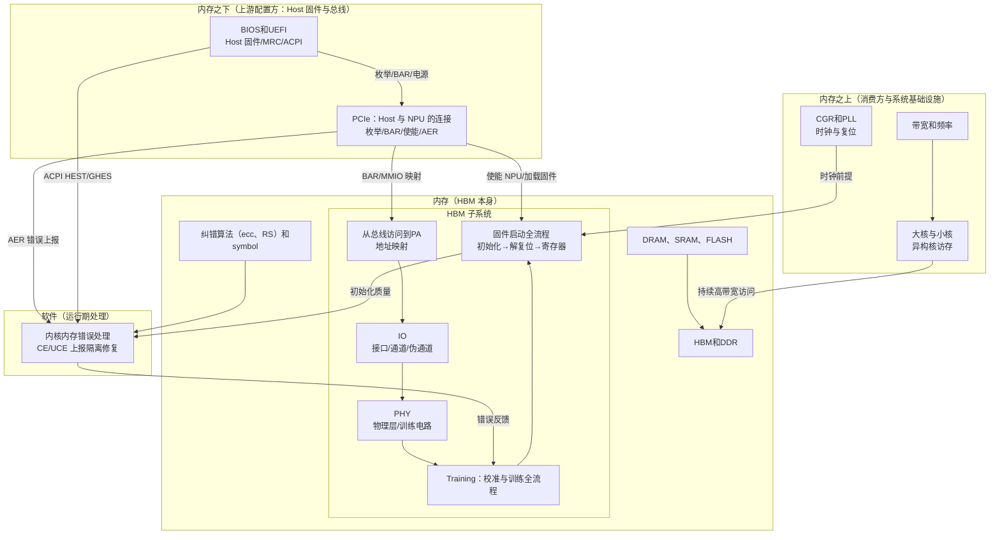

---
tags:
  - 学习地图
  - HBM
  - NPU
  - PCIe
  - 索引
created: 2026-08-14
updated: 2026-08-15
---

# 学习地图：从 HBM 硅片到内核错误处理

> 本库以 **HBM 制造厂商底层软件工程师** 的视角组织：一条主线贯穿 **内存之下（Host 固件与 PCIe 总线）→ 内存（HBM 本身）→ 内存之上（消费者）**，外加 **软件/（内核处理）**。复习时按这张图系统梳理一遍，即可形成对上下游关系的完整理解。

---

## 一、框架总览



---

## 二、两条主线（系统陈述路径）

### 主线 A：启动（从上电到内存可用）

```
BIOS/UEFI（Host 侧 MRC 初始化主存、PCIe 枚举 NPU 并分配 BAR）
   → PCIe 链路训练（LTSSM 至 L0）→ Host 经 BAR 使能 NPU 板卡固件
   → CGR/PLL 时钟稳定
   → NPU 固件：HBM 初始化 → 解复位 → 寄存器配置
   → Training（ZQ → Write Leveling → 读写训练 → margin）
   → 内存可用（刷新 + ECC 使能）
```
对应笔记：[[BIOS和UEFI]] → [[PCIe：Host 与 NPU 的连接]] → [[CGR和PLL]] → [[固件启动全流程]] → [[Training：校准与训练全流程]]

### 主线 B：运行（从位翻转到来访存受损）

```
HBM 位翻转 → ECC 检测 → CE（计数/阈值/软下线）或 UCE（毒化/隔离/修复）
   → 页隔离/进程 SIGBUS/panic
   → 硬件修复（PPR/TSV 冗余）+ 预测性维护
```
对应笔记：[[纠错算法（ecc、RS）和symbol]] → [[内核内存错误处理（CE与UCE）]]

---

## 三、每篇笔记的定位（复习优先级）

| 优先级 | 笔记 | 读它回答什么问题 |
|--------|------|----------------|
| ★★★ | [[固件启动全流程]] | NPU 如何完成 HBM 初始化？解复位顺序？三类寄存器？ |
| ★★★ | [[Training：校准与训练全流程]] | 训练的是什么？ZQ/Write Leveling/DQS gate？失败怎么办？ |
| ★★★ | [[内核内存错误处理（CE与UCE）]] | CE/UCE 怎么上报？软下线 vs 毒化？如何修复？ |
| ★★★ | [[HBM和DDR]] | HBM 为什么是 AI 的答案？带宽公式？ |
| ★★★ | [[PCIe：Host 与 NPU 的连接]] | Host 怎么枚举/使能 NPU？BAR 如何暴露 HBM？AER/DPC 怎么上报？ |
| ★★☆ | [[IO]] / [[PHY]] | 1024-bit 接口、通道/伪通道、PHY 职责 |
| ★★☆ | [[从总线访问到PA]] | 地址如何解码到 bank/row/col？交织？PCIe MMIO 段怎么衔接？ |
| ★★☆ | [[纠错算法（ecc、RS）和symbol]] | SEC-DED、RS、chipkill 各解决什么问题 |
| ★★☆ | [[BIOS和UEFI]] | 上游怎么和 NPU 握手？ACPI 错误通道？ |
| ★☆☆ | [[DRAM、SRAM、FLASH]] / [[带宽和频率]] / [[CGR和PLL]] / [[大核与小核]] | 基础概念支撑 |

---

## 四、高频问题自测 → 对应笔记

| 问题 | 对应笔记 |
|--------|--------|
| 讲一下 HBM 上电到可用的完整流程 | [[固件启动全流程]] |
| 解复位为什么有顺序？ | [[固件启动全流程]] §2.4 |
| training 有哪些步骤，为什么 ZQ 最先？ | [[Training：校准与训练全流程]] |
| HBM 和 DDR 区别？为什么 AI 用 HBM？ | [[HBM和DDR]] |
| 什么是伪通道？ | [[IO]] |
| 实际带宽为什么低于理论值？ | [[带宽和频率]] |
| CE 和 UCE 内核怎么处理？ | [[内核内存错误处理（CE与UCE）]] |
| MCE/APEI/EDAC 是什么关系？ | [[内核内存错误处理（CE与UCE）]] §3 |
| BIOS 和 NPU 固件什么关系？ | [[BIOS和UEFI]] |
| chipkill 是什么？RS 码按 symbol 纠错啥意思？ | [[纠错算法（ecc、RS）和symbol]] |
| Host 怎么经 PCIe 枚举并使能 NPU？ | [[PCIe：Host 与 NPU 的连接]] §二/§四 |
| BAR 怎么分配？Host 如何触达 HBM？ | [[PCIe：Host 与 NPU 的连接]] §二/§三 |
| AER/DPC 是什么？与 CE/UCE 什么关系？ | [[PCIe：Host 与 NPU 的连接]] §五 |

---

## 五、后续扩展方向（TODO）

- [ ] HBM4 hybrid bonding 与 base die 逻辑化深入
- [ ] CXL 内存扩展 vs HBM 的定位对比（初步口径见 [[PCIe：Host 与 NPU 的连接]] §六）
- [ ] GPU/NPU 具体案例（如某加速卡的 memory subsystem 拆解）
- [ ] roofline 模型与算力/带宽匹配的量化练习
- [ ] Linux EDAC 驱动的代码级阅读笔记
- [ ] PCIe 8.0（256 GT/s）与 Gen6/7 FLIT 模式深入；AER/DPC 驱动（aer.c/dpc.c）代码级阅读
