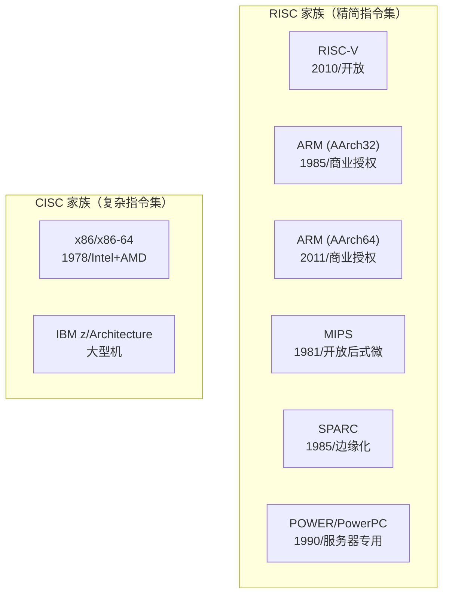

---
tags:
  - ISA
  - 芯片架构
  - RISC-V
  - ARM
  - x86
created: 2026-08-15
updated: 2026-08-15
---

# 指令集架构全景：RISC-V、ARM 与 x86

> 回答两个问题：**RISC-V 具体是什么？和它"平级而论"的又是什么？** ——RISC-V 是一种指令集架构（ISA）；与它处于同一抽象层级的是 x86/x86-64 与 ARM（AArch64/AArch32）等 ISA 家族。本篇给出 ISA 全景与对比框架，细节见 [[RISC-V：指令集与特权架构]] 与 [[ARM与AArch64：架构演进与差异]]。
>
> 相关笔记：[[RISC-V：指令集与特权架构]] · [[ARM与AArch64：架构演进与差异]] · [[大核与小核]] · [[编译器架构与编译流程]] · [[BIOS和UEFI]]

---

## 一、先厘清层级：ISA 是什么

**ISA（Instruction Set Architecture，指令集架构）**是软件与硬件之间的**契约**：指令编码、寄存器文件、寻址方式、特权/异常模型、内存模型。它位于抽象层次的最底层：

```
应用（编译器产物）→ 操作系统/固件 → ISA（机器可见的契约）→ 微架构（具体实现）
```

- **ISA 与微架构分离**：同一 ISA 可有无数种实现（如 AArch64 的 Apple M 系列与 Cortex-X925 微架构完全不同）；同一微架构思路也可服务不同 ISA（见 [[大核与小核]]）。
- **"平级而论"的边界**：与 RISC-V 平级的，是**同一抽象层级的 CPU ISA 家族**——x86/x86-64、ARM（AArch64/AArch32）、以及 MIPS、SPARC、POWER 等。GPU/加速器的 ISA（PTX、GCN/CDNA、NVPTX）**不是**平级对象：它们依附于宿主 CPU ISA 之上，属于协处理器层级。

---

## 二、RISC-V 具体是什么

| 维度 | 内容 |
|------|------|
| 定义 | **开放、免费、模块化的 RISC 指令集架构**（非商业实现，可自由实现与扩展） |
| 起源 | 2010 年起于 UC Berkeley（David Patterson 团队）；2011 首颗芯片流片；2015 成立 RISC-V 基金会（现 RISC-V International） |
| 指令集 | RV32I/RV64I 基础 + 模块化扩展（M/A/F/D/C/V/Zk 等），定长 32-bit，C 扩展压缩到 16-bit |
| 寄存器 | 32 个通用寄存器（x0 恒零，见 [[RISC-V：指令集与特权架构]] §二） |
| 特权架构 | M/S/U 三级 + SBI 固件接口（[[RISC-V：指令集与特权架构]] §三） |
| 兼容基准 | Profile 机制（RVA23/RVB23，2024-10 定版） |
| 与 ARM/x86 的根本区别 | **ISA 规范免费开放**；ARM/x86 均需商业授权 |

RISC-V 的"具体性"体现在：它不是某个公司的产品，而是一个**开放标准 + 竞争性实现生态**（SiFive、平头哥、香山等各自实现），类似"Linux 之于操作系统"。

---

## 三、平级而论的 ISA 家族全景



| ISA | 年代/起源 | 指令风格 | 授权 | 当前生态位 |
|-----|----------|---------|------|-----------|
| **x86/x86-64** | 1978 Intel 8086；2003 AMD 提出 x86-64 | CISC（微码译码） | Intel/AMD 交叉授权 | PC、服务器、数据中心（存量最大） |
| **ARM（AArch64）** | 1985 Acorn；2011 ARMv8 引入 AArch64 | RISC | Arm 公司 IP 授权 | 移动、嵌入式、云服务器、AI（份额最大出货量） |
| **RISC-V** | 2010 UC Berkeley | RISC | **开放免费** | 嵌入式、AI 加速器、新势力 SoC；服务器与移动渗透中 |
| MIPS | 1981 Stanford | RISC | 曾开放（2019 后式微） | 路由器/嵌入式存量；新设计基本停止 |
| SPARC | 1985 Sun | RISC | 曾开放（2017 Oracle 停更） | 边缘化，遗留服务器 |
| POWER | 1990 IBM（POWER1） | RISC | IBM | 高端服务器/大型机 |
| z/Architecture | 2000（S/360 1964 的血统） | CISC | IBM | 大型机 |

---

## 四、三条划分主线（对比框架）

**① CISC vs RISC**

| | CISC（x86） | RISC（ARM/RISC-V） |
|---|------------|-------------------|
| 指令 | 复杂、变长、一指令多功能 | 简单、定长（大多）、load/store |
| 译码 | 微码/译码器复杂 | 硬件直接译码简单 |
| 编译器 | 依赖编译器压榨复杂指令 | 依赖编译器优化简单指令序列 |
| 功耗/面积 | 高 | 低 |

**② 授权模式（RISC-V 的独特位）**

| | x86 | ARM | RISC-V |
|---|-----|-----|--------|
| ISA 归属 | Intel/AMD | Arm 公司 | RISC-V International（开放） |
| 可否免费使用 | 否 | 否（需 IP 授权） | **是** |
| 修改/扩展 | 不开放 | 架构授权者有界定制 | **允许**（命名不冲突即可） |

**③ 生态位分工**

| 场景 | 主流 ISA | 原因 |
|------|---------|------|
| PC/通用服务器 | x86-64 | 存量软件、软件生态 |
| 手机/平板 | AArch64 | 能效 + 生态 |
| 嵌入式/MCU | ARM Cortex-M / RISC-V | 能效、成本（RISC-V 免授权费） |
| AI 加速器/新 SoC | RISC-V 管理核 + 自研加速器 | 开放可定制、免授权 |

---

## 五、与既有笔记的衔接

- [[RISC-V：指令集与特权架构]] / [[ARM与AArch64：架构演进与差异]]：本篇是这两篇的"地图"，它们是"细节"。
- [[大核与小核]]：x86 P/E 核、ARM big.LITTLE 是"同一 ISA 下的异构核"实例；跨 ISA 的对比见本篇。
- [[编译器架构与编译流程]]：编译器后端以 ISA 为目标（[[主流编译器：GCC、Clang与MSVC]] 的后端支持面）。
- [[BIOS和UEFI]]：UEFI 生于 x86 生态，现已覆盖 AArch64/RISC-V——"ISA 之上最靠近硬件的软件层"。

---

## 参考资料

- [RISC-V（Wikipedia：起源与规范）](https://en.wikipedia.org/wiki/RISC-V)
- [x86-64（AMD64，Wikipedia）](https://en.wikipedia.org/wiki/X86-64)
- [ARM 架构家族（Wikipedia）](https://en.wikipedia.org/wiki/ARM_architecture_family)
- [MIPS 架构（Wikipedia）](https://en.wikipedia.org/wiki/MIPS_architecture)
- [POWER/PowerPC（Wikipedia）](https://en.wikipedia.org/wiki/IBM_POWER_architecture)
- [RISC-V International 官网](https://riscv.org/)
- [Arm 官网架构页](https://www.arm.com/architecture)
- 关联笔记：[[RISC-V：指令集与特权架构]] · [[ARM与AArch64：架构演进与差异]] · [[大核与小核]] · [[编译器架构与编译流程]] · [[主流编译器：GCC、Clang与MSVC]] · [[BIOS和UEFI]]
