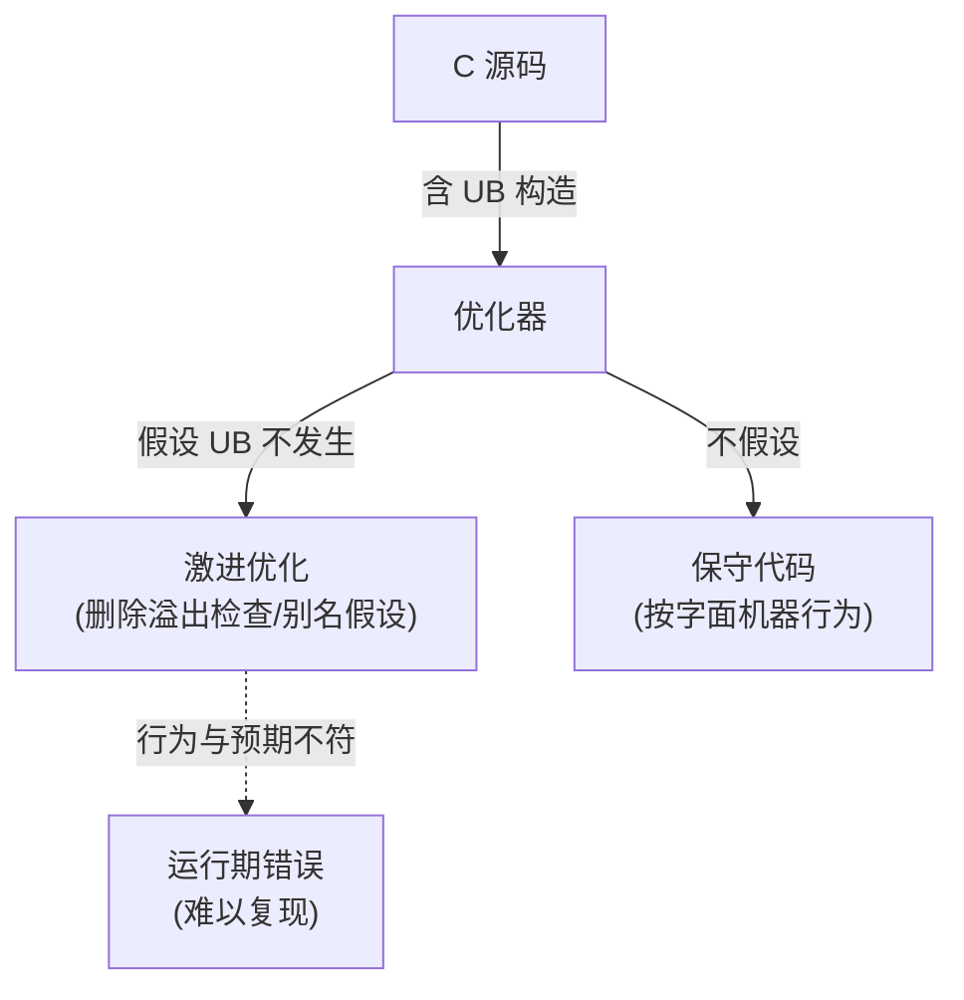

---
tags:
  - C语言
  - 编译器
  - ABI
  - GCC
  - MSVC
created: 2026-08-15
updated: 2026-08-15
---

# C 语言的编译差异：扩展与 ABI

> 同一段 C 代码，在 GCC、Clang、MSVC 下的行为可能不同：语言扩展、未定义行为处理、数据模型与调用约定四个层面都存在差异。本篇梳理"对 C 的编译差异"——理解这些差异是跨平台固件/内核代码（[[固件启动全流程]]、[[内核与编译器：构建与ABI]]）可移植的前提。
>
> 相关笔记：[[编译器架构与编译流程]] · [[主流编译器：GCC、Clang与MSVC]] · [[内核与编译器：构建与ABI]]

---

## 一、C 标准与编译器实现的分野

C 由 ISO/IEC 9899 标准化，但标准为编译器实现留下三块自由裁量空间：**实现定义（implementation-defined）**、**未指定（unspecified）** 与 **未定义行为（undefined behavior）**——这是"不同编译器编译结果不同"的制度性根源。

| 标准版本 | 发布 | 关键增量 |
|---------|------|---------|
| C89/C90 | 1989/1990 | 首个 ISO 标准，函数原型 |
| C99 | 1999 | `//` 注释、变长数组、`stdint.h`、内联 |
| C11 | 2011 | `_Atomic`、线程、`_Generic` |
| C17 | 2018 | C11 勘误版，无新特性 |
| C23 | 2024 | `nullptr`、`#elifdef`、十进制浮点、`bool` 原生化 |

> 各编译器对上述版本的默认标准与支持矩阵见 [[主流编译器：GCC、Clang与MSVC]]（版本数据带来源核实）。

---

## 二、未定义行为：编译器利用的"自由"



| 差异点 | 编译器可选项 | 效果 |
|--------|-------------|------|
| 有符号整数溢出 | `-fwrapv`（回绕）vs 默认（UB，优化器可假设不发生） | 溢出检查代码可能被删 |
| 严格别名 | `-fstrict-aliasing`（默认开）vs `-fno-strict-aliasing` | 类型双关代码行为差异（内核用 `-fno-strict-aliasing`，见 [[内核与编译器：构建与ABI]]） |
| `char` 符号性 | `-fsigned-char`/`-funsigned-char` | ARM 默认 unsigned，x86 默认 signed |
| 枚举大小 | `-fshort-enums` | ABI 相关：改变 `enum` 布局 |
| 空指针/除零 | 各实现 | 运行时陷阱或 UB |

---

## 三、三大编译器的 C 扩展

| 维度 | GCC / Clang | MSVC |
|------|------------|------|
| 属性 | `__attribute__((packed, aligned, section, unused))` | `__declspec(dllexport, align, noinline)` |
| 强制内联 | `__attribute__((always_inline))` / `__forceinline` | `__forceinline` |
| 类型推导 | `typeof` / `__auto_type` | `decltype`（C++ 侧） |
| 内建函数 | `__builtin_expect`、`__builtin_prefetch`、`__builtin_types_compatible_p` | `_Interlocked*`、编译器内建 |
| pragma | `#pragma GCC` 系列 | `#pragma once`、`#pragma pack`、`#pragma intrinsic` |

- Clang 刻意兼容 GCC 扩展（`__attribute__`、`__builtin_*`），以换取 GCC 代码库的无缝迁移——这是 Linux 内核能整体切换到 Clang 构建的基础。
- `#pragma pack` 影响结构布局（ABI 层面）；`__attribute__((section))` 让固件把符号放进指定段（[[编译器架构与编译流程]] §六 的链接脚本配合）。

---

## 四、数据模型：同一 C 代码、不同的 long

```c
/* 同一段代码在不同平台的 ABI 下结果不同 */
sizeof(long)      // LP64(64-bit) / LLP64(32-bit)
sizeof(void*)     // 8 或 4
```

| 数据模型 | `int` | `long` | 指针 | 平台 |
|---------|-------|--------|------|------|
| ILP32 | 32 | 32 | 32 | 32 位 ARM（A32）、RISC-V RV32 |
| LP64 | 32 | **64** | 64 | Linux x86-64/AArch64/RISC-V RV64 |
| LLP64 | 32 | **32** | 64 | **Windows x64** |

- 关键差异在 `long`：Windows 用 LLP64（`long`=32-bit，与 `int` 相同），Unix 系用 LP64——涉及 `long` 的跨平台代码（位运算、格式串 `%ld`）是移植事故高发区。
- 固件场景：32 位管理核（如 ARM Cortex-M/A32）与 64 位主核的数据模型并存，跨核共享结构必须显式用 `stdint.h` 定宽类型（`uint32_t`/`uint64_t`），不依赖 `int`/`long` 宽度。

---

## 五、调用约定与 ABI 差异

| ABI | 传参方式 | 栈/红区 | 平台 |
|-----|---------|--------|------|
| System V AMD64 | 前 6 个整数参数用 rdi/rsi/rdx/rcx/r8/r9 | 128 字节红区（red zone） | Linux/macOS x86-64 |
| Windows x64 | 前 4 个参数 rcx/rdx/r8/r9，需 shadow space | 无红区 | Windows x64 |
| AAPCS64 | x0-x7 传参 | 无红区 | AArch64（Linux/固件通用） |

- **红区（red zone）**：栈指针以下 128 字节可被信号处理时使用——System V 有、Windows 无；内联汇编/无栈帧代码依赖此约定。
- **符号修饰（name mangling）**：MSVC 对 C 函数使用 `_name@N`（stdcall 传参字节数）修饰，GCC/Clang 在 x86 上默认不修饰——同名函数在两端生成不同符号名，是链接错误与 dllimport 问题的来源。
- **结构返回**：大结构按指针返回的实现约定各 ABI 不同（sret 寄存器 vs 隐式第一参数）——涉及跨编译器结构 ABI 兼容（[[内核与编译器：构建与ABI]] §四）。

---

## 六、交叉编译与固件场景的编译差异实践

- **三元组与 ABI 后缀**：`riscv64-linux-gnu`（LP64D）、`arm-none-eabi`（裸机 EABI，无 OS）、`aarch64-none-elf`——后缀决定数据模型与调用约定。
- **`volatile` 与编译器优化**：硬件寄存器必须 `volatile`，否则优化器可能合并/删除读写——固件 MMIO 访问的正确性是编译差异最直接的战场。
- **`-ffreestanding` + `-nostdlib` + 链接脚本**：裸机固件的标准组合（[[编译器架构与编译流程]] §五/§六）。
- **`-O` 级别与 `-fno-*` 组合**：固件常用 `-Os`（体积）+ `-fno-builtin` + `-fno-strict-aliasing`；优化级别变化可能暴露 UB 代码（见 §二）。

---

## 参考资料

- [ISO/IEC 9899（C 标准，C17/C23 版本沿革）](https://www.iso.org/standard/74528.html)
- [GCC C 扩展文档（__attribute__/__builtin）](https://gcc.gnu.org/onlinedocs/gcc/C-Extensions.html)
- [MSVC 编译器选项与扩展（learn.microsoft.com）](https://learn.microsoft.com/en-us/cpp/c-language/)
- [System V AMD64 ABI（x86-64 psABI）](https://gitlab.com/x86-psABIs/x86-64-ABI)
- [AAPCS64（AArch64 过程调用标准）](https://developer.arm.com/documentation/102374)
- [Data model（LP64/LLP64，Wikipedia）](https://en.wikipedia.org/wiki/64-bit_computing#64-bit_data_models)
- 关联笔记：[[编译器架构与编译流程]] · [[主流编译器：GCC、Clang与MSVC]] · [[内核与编译器：构建与ABI]] · [[固件启动全流程]] · [[RISC-V：指令集与特权架构]] · [[ARM与AArch64：架构演进与差异]]
