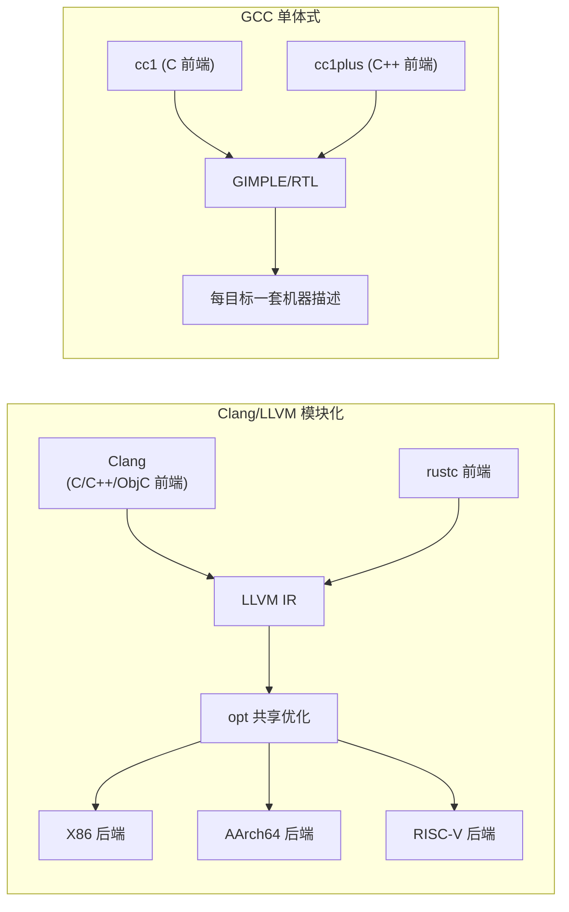

---
tags:
  - 编译器
  - GCC
  - LLVM
  - MSVC
  - Clang
created: 2026-08-15
updated: 2026-08-15
---

# 主流编译器：GCC、Clang 与 MSVC

> 主流 C/C++ 编译器三条主线：**GCC**（GNU，自由软件基金会）、**Clang/LLVM**（模块化编译器基础设施）、**MSVC**（Microsoft Visual C/C++）。本篇对比三者的架构设计、语言与目标支持、生态分工，以及固件/内核工程中的选型依据。
>
> 相关笔记：[[编译器架构与编译流程]] · [[C语言的编译差异：扩展与ABI]] · [[内核与编译器：构建与ABI]]

---

## 一、三者定位与设计哲学

| | GCC | Clang/LLVM | MSVC |
|---|-----|-----------|------|
| 发起方 | GNU 项目（1987 起） | LLVM 项目（2003 起，Clang 2007） | Microsoft（1983 起） |
| 许可 | GPL（前端/后端一体） | Apache-2.0（LLVM 库式许可） | 商业（随 Visual Studio/Build Tools） |
| 架构 | 单体式：每语言独立前端，内部 GIMPLE/RTL | **模块化**：前端→单一 LLVM IR→按目标分后端；以库形式复用 | 单体式：`cl.exe` + 微软后端（c2.dll） |
| 调试信息 | DWARF | DWARF/PDB | PDB |
| 模块复用性 | 低（内部接口不稳定） | **高**（IR/优化/后端均为可链接库） | 低 |

**LLVM 的模块化是产业拐点**：语言实现者只写前端、芯片厂商只写后端（TableGen 描述指令），中间优化共享——GPU 编译器（AMD ROCm、NVIDIA CUDA 的 libNVVM）、新 ISA 移植（RISC-V 后端 2016 年随 LLVM 3.9 引入）均基于此，见 [[RISC-V：指令集与特权架构]]。

---

## 二、语言与平台支持面

| 维度 | GCC | Clang | MSVC |
|------|-----|-------|------|
| 主要语言 | C/C++/Fortran/Ada/Go/D 等 | C/C++/Objective-C（Clang 前端）+ 众多第三方前端（Rust、Julia、Swift） | C/C++/C#(Roslyn 独立) |
| 宿主平台 | Linux/macOS/Windows（MinGW）/裸机交叉 | 同左，且**作为库嵌入 IDE/工具** | Windows 为主 |
| 目标架构 | 数十种（含 AVR、MSP430 等小众 MCU） | 数十种（LLVM 后端），新 ISA 最快落地 | x86/x64/ARM64（Windows 生态） |
| 标准支持 | C/C++ 全版本 | C/C++ 全版本，**C23/C++23 跟进最快** | C11/C17 完整；C23 部分跟进 |

> C 标准支持矩阵与默认标准（GCC/Clang/MSVC 各自对 C23/C2y 的支持与 `-std` 选项）随版本变化，核实数据见文末"版本与标准支持"表。

---

## 三、生态分工：谁在哪用

| 场景 | 主流选择 | 原因 |
|------|---------|------|
| Linux 内核 | GCC（默认）、Clang（完整支持） | 内核与 GNU 工具链深度绑定（[[内核与编译器：构建与ABI]]） |
| macOS/iOS | Apple Clang | Xcode 官方工具链 |
| Windows 应用/驱动 | MSVC | PE/COFF + MSVC ABI（[[C语言的编译差异：扩展与ABI]] §五） |
| 固件/裸机 | GCC 交叉链（`arm-none-eabi-gcc` 等）+ Clang | 链接脚本/段控制成熟；LLVM 因许可更适合商业 IDE 集成 |
| GPU/异构 | LLVM 系（ROCm/NVVM/oneAPI） | 模块化后端可定制 |
| RISC-V 开发 | GCC + LLVM 双链并进 | 新 ISA 生态起步即双工具链 |

---

## 四、交叉编译工具链与固件工程

- **工具链三元组**决定目标：`aarch64-none-elf`（裸机固件）、`arm-none-eabi`（Cortex-M/R 裸机）、`riscv64-unknown-elf`、`x86_64-w64-mingw32`（Windows 目标）。
- 固件常用链：GNU Arm Embedded Toolchain（arm-none-eabi-gcc）、Linaro/Arm 的 AArch64 链；Clang 以 `--target=` 切换目标，同一安装可交叉编译所有架构——这是 LLVM 架构优势的直接体现。
- 链接脚本与 `-nostdlib`、`-ffreestanding` 组合见 [[编译器架构与编译流程]] §五/§六；对 HBM 固件的具体意义见 [[固件启动全流程]]。

---

## 五、版本与标准支持（核实数据）

> 本节数值经 Wikipedia 汇总页（转引官方发布公告）与官方页面（gcc.gnu.org / llvm.org / learn.microsoft.com）交叉核对，时点 2026-08。

| 项目 | 核实结果 |
|------|---------|
| GCC 最新稳定版 | **16.1**（2026-04-30 发布） |
| GCC C 默认标准 | **gnu23**（GCC 15 起；C2y/C++26 实验性支持） |
| LLVM/Clang 最新版 | **22.1.8**（2026-06-16；Clang 版本随 LLVM 同号） |
| Clang C 标准支持 | `-std=c23`/`-std=c2y`，官方状态 **Partial**；默认 gnu17 |
| MSVC 最新版 | Visual C++ **2026**（= VC 14.50，2025-11-11；14.51 更新 2026-06-15） |
| MSVC C 标准 | `/std:c11`、`/std:c17`（VS 2019 16.8 起）；**C23 支持不完整** |
| `_MSC_VER` | 编译器版本 19.xx 去掉小数点后取两位（VC 2022=193x，VC 2026=195x 区间） |
| Linux 内核最低编译器 | 见 `docs.kernel.org/process/changes.html`（随内核版本变化） |

- **C23 落地的梯队差**：GCC 15 起已把 C23 设为默认（gnu23）；Clang 22 官方仍标 Partial、默认 gnu17；MSVC 只完整覆盖 C11/C17——三者的 C23 成熟度次序即生态差异的缩影，也是 [[C语言的编译差异：扩展与ABI]] 所述"同一段 C 不同行为"的版本背景。

---

## 参考资料

- [GCC 官网（发布公告与 C 标准支持）](https://gcc.gnu.org/)
- [LLVM 官网（版本发布与架构文档）](https://llvm.org/)
- [Microsoft C/C++ 文档（learn.microsoft.com）](https://learn.microsoft.com/en-us/cpp/overview/visual-cpp-in-visual-studio)
- [Linux 内核构建要求（GCC/Clang 最低版本）](https://docs.kernel.org/process/changes.html)
- [LLVM 架构概览（模块化设计）](https://llvm.org/docs/)
- 关联笔记：[[编译器架构与编译流程]] · [[C语言的编译差异：扩展与ABI]] · [[内核与编译器：构建与ABI]] · [[RISC-V：指令集与特权架构]] · [[ARM与AArch64：架构演进与差异]] · [[固件启动全流程]]
