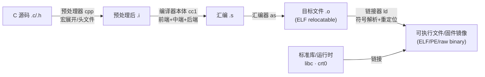
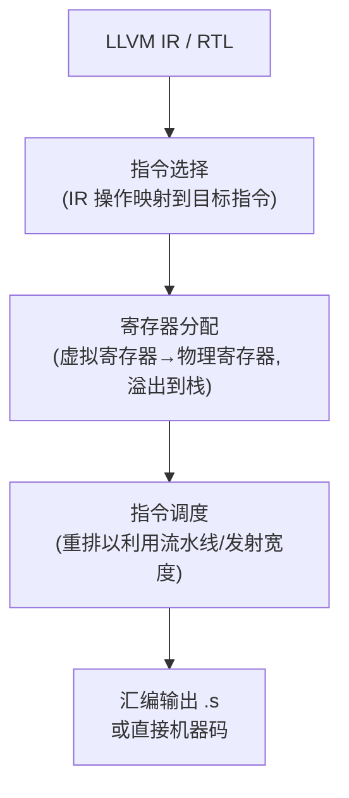

---
tags:
  - 编译器
  - LLVM
  - GCC
  - 工具链
created: 2026-08-15
updated: 2026-08-15
---

# 编译器架构与编译流程

> 编译器是把 C 等高级语言翻译为机器指令的工具链。在本库语境中，[[BIOS和UEFI]] 的固件镜像、[[固件启动全流程]] 的 HBM 固件、[[内核内存错误处理（CE与UCE）]] 所依赖的内核——**全部是编译产物**。理解编译流程，才能理解源码如何变成写入 NOR Flash、由 CPU 执行的二进制。
>
> 相关笔记：[[主流编译器：GCC、Clang与MSVC]] · [[C语言的编译差异：扩展与ABI]] · [[内核与编译器：构建与ABI]] · [[RISC-V：指令集与特权架构]] · [[ARM与AArch64：架构演进与差异]]

---

## 一、编译工具链全景



- **工具链（toolchain）**：编译器 + 汇编器 + 链接器 + 标准库的集合；交叉编译时工具链针对目标架构构建（三元组如 `aarch64-none-elf`、`riscv64-unknown-elf`、`x86_64-w64-mingw32`）。
- 编译与链接分离是 Unix 传统：每个 `.c` 独立编译为 `.o`，最后统一链接——LTO（Link Time Optimization）在链接期把中间表示重新聚合做跨文件优化。

---

## 二、三阶段结构：前端、中端、后端

| 阶段 | 输入 → 输出 | 职责 |
|------|------------|------|
| 前端（Front End） | 源码 → IR | 词法/语法/语义分析，生成中间表示；语言相关、机器无关 |
| 中端（Middle End） | IR → IR | 机器无关优化（SSA、死代码消除、内联、循环优化） |
| 后端（Back End） | IR → 汇编/机器码 | 指令选择、寄存器分配、指令调度；机器相关 |

三阶段分离的意义：N 种语言 × M 种目标架构只需 N + M 个模块，而非 N × M 个——LLVM 正是按此设计的（前端 Clang 一种语言接入，后端覆盖所有支持的目标架构）。

| | GCC | LLVM/Clang |
|---|-----|-----------|
| IR 体系 | GIMPLE（树式，优化用）→ RTL（寄存器传输级，后端用） | 单一 LLVM IR（SSA 形式，前端到后端贯通） |
| 前端 | 各语言独立前端（cc1/c++1plus1/…） | Clang（C/C++/ObjC 同一前端） |
| 后端 | 每个目标一套机器描述（`define_insn`） | TableGen 机器描述 + 后端 target 目录 |
| 调试信息 | DWARF（GDB） | DWARF/PDB |

---

## 三、前端：从源码到 AST

```
词法分析（lexer）→ 语法分析（parser）→ 语义分析 → 中间表示
  字符流 → token 流    → AST 抽象语法树   → 类型检查/符号表
```

| 步骤 | 处理内容 | 典型错误 |
|------|---------|---------|
| 词法分析 | 把字符流切分为 token（关键字/标识符/字面量/运算符） | 非法字符、未闭合字符串 |
| 语法分析 | 按文法把 token 组织为 AST，检查结构 | 缺分号、括号不匹配 |
| 语义分析 | 类型检查、声明可见性、作用域与符号表 | 类型不匹配、未声明变量 |

前端还承担**预处理**（C 的 `#include`/`#define` 由预处理器 cpp 独立完成）与**语言扩展**（如 GCC `__attribute__`、Clang `#pragma clang`）——扩展差异详见 [[C语言的编译差异：扩展与ABI]]。

---

## 四、中端：IR 与机器无关优化

### 4.1 中间表示的关键设计

- **SSA（Static Single Assignment）**：每个变量只被赋值一次，新赋值产生新版本（`%1`、`%2`…）——使数据流分析（定义-使用关系）直接可见，是绝大多数优化 pass 的基础。
- LLVM IR 是三地址码形式，显式类型化：

```llvm
; C: int f(int a, int b) { return a * 2 + b; }
define i32 @f(i32 %a, i32 %b) {
  %t = mul i32 %a, 2
  %r = add i32 %t, %b
  ret i32 %r
}
```

### 4.2 典型优化 pass

| 优化 | 作用 | 例子 |
|------|------|------|
| 死代码消除（DCE） | 删除结果未被使用的计算 | `x = 1; y = 2;` 若 y 未用则删 y 赋值 |
| 常量折叠/传播 | 编译期求值常量表达式 | `a = 2*3` → `a = 6` |
| 函数内联 | 用函数体替换调用，消除调用开销 | `static` 小函数 |
| 循环优化 | 循环不变量外提、强度削减、向量化 | `for` 中 `n*8` 外提 |
| 公共子表达式消除 | 合并重复计算 | `a+b` 出现两次算一次 |

### 4.3 优化级别

| 选项 | 目标 | 固件/内核场景 |
|------|------|--------------|
| `-O0` | 编译快、调试友好 | 调试构建 |
| `-O2` | 常规发布优化 | 内核/固件默认量级 |
| `-O3` | 激进优化（循环向量化等） | 性能关键路径 |
| `-Os` / `-Oz` | 体积优先 | **固件镜像受 Flash 容量约束时的常见选择** |

---

## 五、后端：IR 到机器码



| 后端职责 | 说明 | 与 ISA 的关系 |
|---------|------|--------------|
| 指令选择 | 把 IR 的通用操作匹配到目标架构指令序列 | 取决于 [[RISC-V：指令集与特权架构]] / [[ARM与AArch64：架构演进与差异]] 的指令集 |
| 寄存器分配 | 分配物理寄存器（如 AArch64 的 X0-X30，RISC-V 的 x0-x31） | 寄存器数量与约定由 ABI 决定 |
| 指令调度 | 按目标流水线重排指令 | 与微架构相关（见 [[大核与小核]] 的乱序/有序核差异） |
| 目标描述 | TableGen/GCC `define_insn` 描述每条指令的编码与语义 | 新 ISA 移植后端的工作主体 |

**交叉编译**：宿主机（x86）编译出目标机（NPU 内部管理核/AArch64 板卡）代码。HBM 固件的构建即交叉编译——工具链三元组决定目标 ISA，链接脚本决定镜像布局（见下节）。

---

## 六、链接：从目标文件到镜像

- **目标文件**（ELF relocatable）以节（section）组织：`.text`（代码）、`.data`（已初始化数据）、`.rodata`（只读数据）、`.bss`（零初始化，不占文件空间）、符号表与重定位表。
- **链接器两件事**：① 符号解析（把 `call foo` 的 foo 定位到定义处）；② 重定位（按重定位条目修正地址引用）。
- **链接脚本（linker script, `.lds`）**控制最终布局——对固件至关重要：把 `.text` 放到 Flash 映射地址、`.data` 的加载地址（LMA）与运行地址（VMA）分离（启动时由 crt0/固件搬运到 RAM，对应 [[固件启动全流程]] 的初始化前提）。
- **LTO/ThinLTO**：编译期把 IR 存进 `.o`，链接期重新做跨编译单元优化（内联跨文件函数、全局死代码消除）——GCC 与 LLVM 均已支持。

---

## 七、与既有笔记的衔接

- [[BIOS和UEFI]]：UEFI 镜像按 PE/COFF 格式构建（编译器输出 + GenFw 转换），固件以 NOR Flash 存储（见 [[DRAM、SRAM、FLASH]]）。
- [[固件启动全流程]]：HBM 固件是交叉编译产物；链接脚本与段布局决定其加载与运行地址。
- [[大核与小核]]：后端为不同核型生成代码；指令调度与目标微架构相关。
- [[内核与编译器：构建与ABI]]：内核是编译器最大的消费者之一，构建要求与 ABI 约定见该篇。
- [[RISC-V：指令集与特权架构]] / [[ARM与AArch64：架构演进与差异]]：后端的目标 ISA。

---

## 参考资料

- [Compiler（Wikipedia，三阶段结构与编译流程）](https://en.wikipedia.org/wiki/Compiler)
- [LLVM 文档（IR 语言参考与优化 pass）](https://llvm.org/docs/LangRef.html)
- [GCC Internals（GIMPLE/RTL 与优化 pass）](https://gcc.gnu.org/onlinedocs/gccint/)
- [Static single-assignment form（Wikipedia）](https://en.wikipedia.org/wiki/Static_single-assignment_form)
- [Executable and Linkable Format（ELF 节/符号/重定位）](https://en.wikipedia.org/wiki/Executable_and_Linkable_Format)
- [GNU ld 链接脚本手册](https://sourceware.org/binutils/docs/ld/Scripts.html)
- 关联笔记：[[主流编译器：GCC、Clang与MSVC]] · [[C语言的编译差异：扩展与ABI]] · [[内核与编译器：构建与ABI]] · [[RISC-V：指令集与特权架构]] · [[ARM与AArch64：架构演进与差异]] · [[BIOS和UEFI]] · [[固件启动全流程]] · [[大核与小核]] · [[DRAM、SRAM、FLASH]]
