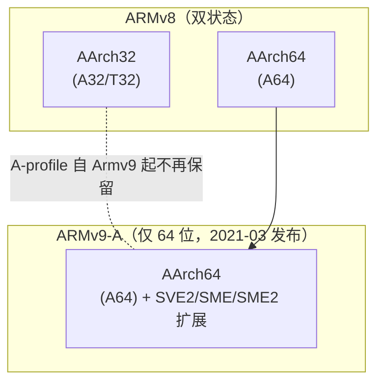

---
tags:
  - ARM
  - AArch64
  - ISA
  - 芯片架构
created: 2026-08-15
updated: 2026-08-15
---

# ARM 与 AArch64：架构演进与差异

> "ARM" 与 "AArch64" 的准确关系：ARM 是架构家族（Armv7/Armv8/Armv9，含 A/R/M 三类 profile）；**AArch64 是 ARMv8 引入的 64 位执行状态**，其指令集称为 A64。32 位执行状态 AArch32（指令集 A32/T32）与之并存于 ARMv8，ARMv9 起仅保留 AArch64。本库语境：NPU 的管理核、Host 与固件（[[固件启动全流程]]）大量运行在 AArch64 上。
>
> 相关笔记：[[RISC-V：指令集与特权架构]] · [[大核与小核]] · [[编译器架构与编译流程]] · [[BIOS和UEFI]]

---

## 一、术语与执行状态

| 术语 | 含义 |
|------|------|
| ARM（架构家族） | Arm 公司定义的指令集架构系列，当前主线 Armv9 |
| AArch64 | 64 位执行状态（ARMv8 起） |
| A64 | AArch64 的指令集：定长 32-bit |
| AArch32 | 32 位执行状态（ARMv8 中可选；A-profile 自 Armv9 起仅保留 AArch64，R/M profile 仍支持 AArch32） |
| A32 / T32 | AArch32 的 ARM / Thumb 指令集 |

---

## 二、AArch64 与 AArch32 的关键差异

| 维度    | AArch64（A64）                         | AArch32（A32/T32）             |
| ----- | ------------------------------------ | ---------------------------- |
| 通用寄存器 | 31 个 64-bit：X0–X30（W0–W30 为低 32 位视图） | 16 个 32-bit：R0–R15           |
| 零寄存器  | XZR/WZR（读取恒 0，写入丢弃；31 号编码在地址/栈相关指令中表示 SP） | 无（用 R 寄存器）                   |
| 程序计数器 | PC 不再是通用寄存器（不可直接读写）                  | R15 即 PC，可参与运算               |
| 指令长度  | 定长 32-bit                            | ARM 32-bit / Thumb 16-bit 混用 |
| 异常等级  | EL0/EL1/EL2/EL3 四级                   | 与特权模式对应，层级不同                 |
| 页表    | 4KB/16KB/64KB 三种粒度                   | 多种但体系不同                      |
| 栈指针   | 按异常等级各自独立 SP                         | 一组分 bank 寄存器                 |

**XZR 与 RISC-V x0 的对照**：二者同为"恒 0、写入丢弃"，使 `MOV`（`ORR Xd, XZR, Xn`）、`CMP`（`SUBS XZR, Xn, Xm`，结果丢弃只设标志）、`NEG`（`SUB Xd, XZR, Xn`）成为伪指令，指令集无需为移动/取负/比较单独编码。差别在于 AArch64 的 **31 号寄存器编码是语境相关的**：一般算术指令中 31 = XZR（零），而 load/store 基址与栈相关指令中 31 = SP（栈指针）；RISC-V 无此歧义（x0 恒零，SP 是 x2 的约定别名，见 [[RISC-V：指令集与特权架构]] §二）。

---

## 三、异常等级（Exception Level）与特权模型

| 等级 | 运行内容 |
|------|---------|
| EL0 | 应用程序 |
| EL1 | 操作系统内核 |
| EL2 | Hypervisor（虚拟化） |
| EL3 | 安全固件（Secure Monitor / Trusted Firmware） |

- 与 RISC-V 的 M/S/U 三级对应（[[RISC-V：指令集与特权架构]] §三），AArch64 多出独立的 EL2 虚拟化层；EL3 承载安全世界切换（TrustZone），是 [[BIOS和UEFI]] 之外的另一条固件栈（ARM Trusted Firmware）。
- 系统寄存器（`SCTLR`、`TCR`、`TTBR0/1`、`VBAR`）承担与 RISC-V CSR 相同的职责；页表走页表基址寄存器 + 转换表遍历。

---

## 四、Armv9 演进与 SIMD/安全扩展

Armv9（2021-03 发布）及后续小版本持续引入扩展：

| 扩展 | 作用 | 引入版本 |
|------|------|---------|
| SVE（可扩展向量） | 向量长度无关编程（128–2048 bit） | Armv8.2-A |
| **SVE2** | 补齐整数/DSP 向量化 | Armv9.0（2021-03） |
| **SME** | 矩阵运算引擎（平铺 tile），面向 AI | Armv9.2（2021） |
| **SME2** | 多向量指令、2b/4b 权重压缩、1b 网络 | Armv9.4（2022-09 宣布） |
| **FP8** | E5M2/E4M3 八位浮点（AI 训练/推理） | Armv9.5（2023-10 宣布） |
| BTI（分支目标识别） | 控制流完整性 | Armv8.5-A |
| MTE（内存标签） | 内存安全标签检查 | Armv8.5-A |
| PAC（指针认证） | 返回地址/指针防篡改 | Armv8.3-A |
| GCS / RME（机密计算） | 守护控制栈 / 机密计算架构 | Armv9.4 / Armv9.2+ |

- 版本推进至 Armv9.7-A（2026 时点）；各小版本发布时间以 Arm 官方公告为准。
- SVE/SME 对编译器与内核有直接要求（向量长度运行期可变，需内核保存上下文）——是 [[内核与编译器：构建与ABI]] 所述"内核裁定 ABI"的延伸案例。

---

## 五、Profile 体系与授权模式

| Profile | 定位 | 代表产品线 |
|---------|------|-----------|
| A（Application） | 高性能、运行 OS | Cortex-X（旗舰）、Cortex-A（主流）、Neoverse（服务器） |
| R（Real-time） | 实时/安全关键 | Cortex-R |
| M（Microcontroller） | 低功耗 MCU | Cortex-M |

**两种授权模式**（与 RISC-V 开放模式对比）：

| 模式 | 说明 | 例子 |
|------|------|------|
| 核 IP 授权 | 采购 Arm 设计好的核（Cortex/Neoverse） | 绝大多数手机/服务器 SoC |
| 架构授权 | 仅授权 ISA，自研微架构实现 | Apple M 系列、NVIDIA Grace（Neoverse 之外的自研核） |

- [[大核与小核]] 中的 Apple Performance/Efficiency、Intel P/E、Cortex-X/Cortex-A 即运行于此生态之上；苹果 M 系列是"架构授权 + 自研实现"路线的代表——与 RISC-V"免费 ISA + 自研"路线的差异只剩授权费与生态成熟度（对比见 [[RISC-V：指令集与特权架构]] §一）。

---

## 六、与既有笔记的衔接

- [[大核与小核]]：Cortex-X/Cortex-A55 即 AArch64 生态的大小核实例；调度与访存特征见该篇。
- [[BIOS和UEFI]]：AArch64 平台的 UEFI（EDK2 的 AARCH64 支持）与 EL3 固件（TF-A）共同构成 Host 启动栈。
- [[固件启动全流程]]：NPU 管理核运行 AArch64 时，HBM 固件即交叉编译到 `aarch64-none-elf`/`aarch64-linux-gnu` 的产物（[[编译器架构与编译流程]] §五）。
- [[内核与编译器：构建与ABI]]：Linux/Windows 在 AArch64 上的 ABI（AAPCS64 调用约定，见 [[C语言的编译差异：扩展与ABI]] §五）。

---

## 参考资料

- [Arm 架构官网（Armv9-A 架构文档）](https://www.arm.com/architecture)
- [Arm A-Profile 架构开发指南（AAPCS64 等）](https://developer.arm.com/documentation)
- [ARM Trusted Firmware（TF-A，EL3 固件参考实现）](https://www.trustedfirmware.org/projects/tf-a/)
- [Arm Cortex-X 与 Neoverse 产品页](https://www.arm.com/products/silicon-ip-cpu)
- [Apple M 系列芯片（Apple 官方页）](https://www.apple.com/mac/)
- 关联笔记：[[RISC-V：指令集与特权架构]] · [[大核与小核]] · [[编译器架构与编译流程]] · [[BIOS和UEFI]] · [[固件启动全流程]] · [[内核与编译器：构建与ABI]] · [[C语言的编译差异：扩展与ABI]]
