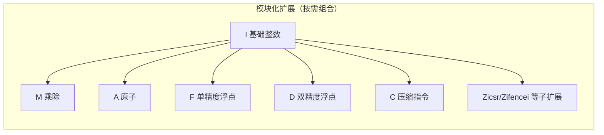

---
tags:
  - RISC-V
  - ISA
  - 芯片架构
  - 指令集
created: 2026-08-15
updated: 2026-08-15
---

# RISC-V：指令集与特权架构

> RISC-V（发音 risk-five）是 RISC-V 国际基金会维护的**开放指令集架构**：ISA 规范免费开放，任何厂商可自行实现（芯片可商业授权）。本库视角：NPU/加速器的管理核与固件（[[固件启动全流程]]）可能运行在 RISC-V 核上，编译器（[[编译器架构与编译流程]]）的后端为其生成代码。
>
> 相关笔记：[[ARM与AArch64：架构演进与差异]] · [[编译器架构与编译流程]] · [[固件启动全流程]] · [[大核与小核]]

---

## 一、ISA 与实现分离：开放规范模式

| 维度 | RISC-V | ARM |
|------|--------|-----|
| ISA 规范 | 开放免费（riscv.org 发布，BSD 类许可） | 私有，需 ARM 授权 |
| 实现 | 任何厂商自研或采购 IP | 采购 Cortex/Neoverse IP 或架构授权自研 |
| 修改权 | 允许（非标准扩展须改名不冲突） | 架构授权者有界定制 |
| 生态组织 | RISC-V International（非营利会员制） | Arm 公司（商业） |

- **Profile 机制**：为避免扩展碎片化，RISC-V 以 profile（如 RVA23 应用 profile、RVB23 嵌入式 profile）固化一组必选/可选扩展，作为软件生态的兼容基准——对应 [[C语言的编译差异：扩展与ABI]] §六 中工具链三元组的 `rv64gc` 等后缀。

---

## 二、基础整数指令集与寄存器

| 项目 | 内容 |
|------|------|
| 基础指令集 | RV32I（32 位）、RV64I（64 位） |
| 通用寄存器 | 32 个：x0–x31（x0 恒为 0，写入丢弃） |
| 指令长度 | 基础 32-bit 定长；C 扩展引入 16-bit 压缩指令 |
| 寻址 | 加载/存储架构：运算只在寄存器，访存走 load/store |
| 分支/跳转 | 条件分支（beq/bne…）、jal/jalr |

**零寄存器 x0 的作用**：x0 恒为 0、写入丢弃，充当"通用常数源与结果垃圾桶"，是精简指令集的惯用设计：
- **伪指令的基石**：`mv rd, rs` = `addi rd, rs, 0`；`li rd, 0` = `addi rd, x0, 0`；`neg rd, rs` = `sub rd, x0, rs`——mov/neg 等无需独立指令编码，汇编器展开为普通 ALU 指令，指令集因此精简（RISC-V 基础指令集只有 40-52 条）。
- **只关心副作用的操作**：比较结果写 x0 即丢弃；需要"执行指令但不要结果"的场合统一以 x0 为目标。
- **不保存返回地址的跳转**：`jal x0, fn` 表示尾调用（跳走不返回）；`jalr x0, ra, 0` 为纯间接跳转。
- **硬件简化**：x0 硬连线为 0（可不实现存储单元），省面积与功耗。

- **RV64GC** = RV64I + M/A/F/D/Zicsr/Zifencei + C——Linux 发行版与工具链的通用基线（`riscv64-linux-gnu` 默认目标）。
- 常见扩展：**V（向量扩展 1.0）**、位操作 B（Zba/Zbb/Zbs）、加密 K（Zk 系列）、虚拟化 H（Hypervisor）、AIA（高级中断架构）、IOMMU——向量与虚拟化扩展是 RISC-V 进入 AI/数据中心的关键（与 [[HBM和DDR]] 场景的加速器生态相关）。

---

## 三、特权架构：模式、CSR 与固件接口

| 层级 | 名称 | 角色 |
|------|------|------|
| M-mode | Machine | 最高权限，固件（M 态）运行处；不可屏蔽中断与物理资源管理 |
| S-mode | Supervisor | 操作系统内核（如 Linux） |
| U-mode | User | 应用程序 |

- **CSR（Control and Status Register）**：特权状态与控制的统一寄存器空间（如 `mstatus`、`mepc`、`satp` 页表基址）——通过专用 CSR 指令（csrrw/csrrs）访问。
- **SBI（Supervisor Binary Interface）**：S-mode 与 M-mode 固件之间的标准接口（定时器、IPI、远程 fence 等）——地位类似 BIOS/UEFI 对 OS 的抽象（[[BIOS和UEFI]]），OpenSBI 是主流参考实现；与 [[固件启动全流程]] 的分层思想同构：固件提供硬件抽象，上层软件按接口使用。
- **页表**：Sv39/Sv48/Sv57 分页（39/48/57 位虚拟地址），与 AArch64 的 4KB/16KB/64KB 页表对照见 [[ARM与AArch64：架构演进与差异]]。

---

## 四、Profile 与软件生态

- **RVA 系列**（应用 profile）：RVI20/RVA20/RVA22 于 2023-03 定版 1.0；**RVA23 与 RVB23 于 2024-10 定版 1.0**，其中 RVA23U64 把 V 向量扩展设为强制（RVA22 中为可选）——profile 逐代收紧扩展集合，为 Linux 发行版与工具链提供"开箱即用"的兼容目标。
- **Linux 内核**：`arch/riscv` 自内核 4.15 起合入主线，持续补齐 AIA/IOMMU/Zkr 等扩展支持；GCC 与 LLVM 双工具链均维护 RISC-V 后端。
- **实现生态**：SiFive（P 系列高性能核）、平头哥玄铁（XuanTie C/R 系列）、香山（开源高性能处理器项目）——IP 采购与开源实现并存，是"开放 ISA + 商业实现"模式的样本。

---

## 五、与既有笔记的衔接

- [[固件启动全流程]]：RISC-V 系统里 M-mode 固件（含 SBI）承担与 HBM 固件同构的"初始化硬件、向上提供抽象"角色。
- [[大核与小核]]：RISC-V 异构组合（高性能核 + 高效核）与 ARM big.LITTLE 同构；标量/向量核划分与 NPU 内部分工对应。
- [[编译器架构与编译流程]]：`riscv64-unknown-elf`/`riscv64-linux-gnu` 交叉链与 LLVM 后端；RV64GC 即工具链的目标基线。
- [[BIOS和UEFI]]：SBI 与 UEFI 是两种固件-OS 接口风格（轻量 vs 完整），NPU 板卡固件栈可类比。

---

## 参考资料

- [RISC-V 官方规范（非特权/特权 ISA 手册）](https://riscv.org/technical/specifications/)
- [RISC-V RVA23 Profile（riscv.org）](https://riscv.org/announcements/)
- [Linux 内核 arch/riscv 文档](https://docs.kernel.org/arch/riscv/)
- [OpenSBI（SBI 参考实现）](https://github.com/riscv-software-src/opensbi)
- [SiFive 处理器产品页](https://www.sifive.com/cores)
- [平头哥玄铁处理器（阿里达摩院）](https://www.t-head.cn/)
- 关联笔记：[[ARM与AArch64：架构演进与差异]] · [[编译器架构与编译流程]] · [[固件启动全流程]] · [[大核与小核]] · [[BIOS和UEFI]] · [[主流编译器：GCC、Clang与MSVC]]
