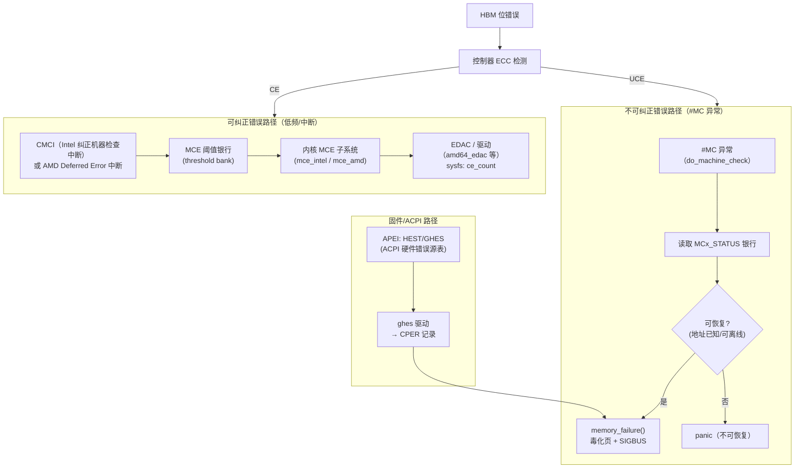

---
tags:
  - 内核
  - RAS
  - HBM
  - ECC
  - 内存架构
  - Linux
created: 2026-08-14
updated: 2026-08-14
---

# 内核内存错误处理：CE/UCE 的上报、隔离与修复

> 启动之后，HBM 错误成为常态事件：位翻转（bit flip）在超高密度 DRAM 上是**统计必然**，仅存在发生时间的差异。本文记录 Linux 内核将内存错误转化为可管理事件的机制——**CE（可纠正）的计数上报与 UCE（不可纠正）的隔离修复**，以及 HBM 制造厂商视角下的链路要点。
>
> 相关笔记：[[固件启动全流程]] · [[纠错算法（ecc、RS）和symbol]] · [[BIOS和UEFI]] · [[HBM和DDR]]

---

## 一、错误来源：位翻转

| 错误源 | 机理 | 表现 |
|--------|------|------|
| 粒子撞击（α 粒子/宇宙射线） | 高能粒子电离产生电荷，翻转存储单元 | 单比特位翻转（最常见） |
| 漏电/数据保持 | 电容电荷随时间泄漏（温度越高越快） | 弱单元翻转，tREFI 不足时加剧 |
| 行锤击（Row Hammer） | 频繁激活相邻行导致电荷干扰 | 相邻行多位翻转 |
| 工艺缺陷 | TSV/μbump/单元缺陷、弱焊点 | 固定错误（可被修复机制处理） |
| 电源/信号完整性问题 | IR drop、串扰、时序漂移 | 间歇性错误（training margin 不足） |

**ECC 是错误纠正机制**（详见 [[纠错算法（ecc、RS）和symbol]]）：

```
HBM 数据 ──▶ 控制器内联 ECC / on-die ECC ──▶ CE（可纠正，交给系统计数）
                                      └──────▶ UCE（不可纠正，触发内核处理）
```

---

## 二、错误分类：CE 与 UCE

| | CE（Correctable Error，可纠正错误） | UCE（Uncorrectable Error，不可纠正错误） |
|---|---|---|
| 定义 | ECC 能纠回来（如 1-bit 翻转） | ECC 纠不回来（如 2-bit 错误）或数据已损坏 |
| 对数据的影响 | 无（已纠正） | 数据可能已损坏 |
| 系统策略 | **计数 + 阈值 + 预警 + 软下线** | **毒化（poison）+ 隔离 + 终止进程/宕机** |
| 性能代价 | 有（读改写、ECC 计算、可能触发 scrub） | 致命（按策略 kill 或 panic） |
| 频率预期 | 正常机器上低频出现；持续高频 = 硬件劣化信号 | 极低；一旦出现要严肃对待 |

> **核心思想**：CE 用于评估错误速率与分布，以预警硬件劣化（某 bank 反复 CE → 该区域要下线）；UCE 需要立即隔离，防止损坏扩散。

---

## 三、上报路径：从硬件到内核



### 3.1 x86 MCA（Machine Check Architecture）——硬件侧的"报告机制"

- CPU 有 **MSR 银行**（IA32_MC0_STATUS / IA32_MC0_ADDR / IA32_MC0_MISC 等），每个银行对应一种硬件错误源（内存控制器、缓存、总线……）。
- **#MC 异常**：不可纠正错误发生时 CPU 触发异常 → 内核 `do_machine_check()` 读取银行 → 判定可恢复性。
- **CMCI（Corrected Machine Check Interrupt）**：可纠正错误用**中断**（而非异常）上报，不打断指令流，适合高频 CE。
- **MCE Thresholding（阈值）**：每个银行可配置阈值，CE 连续达到阈值才中断 → 避免中断风暴。Linux 6.7 起新增 **CMCI 风暴处理**（非风暴阈值 1、风暴阈值 32749，风暴时自动调高）。

### 3.2 ACPI APEI——固件与操作系统之间的标准错误上报接口

- **HEST（Hardware Error Source Table）**：声明系统有哪些错误源（GHES 等）。
- **GHES（Generic Hardware Error Source）**：通用错误源，固件把错误写成 **CPER（Common Platform Error Record）** 记录 → 内核 `ghes` 驱动读取。
- **重要性**：APEI 让**非 x86 特有**的错误源（如 NPU 板卡的错误、HBM 控制器的错误）也能统一纳入内核处理路径——这是 NPU 的 HBM 错误进入 Linux 处理路径的标准通道。

### 3.3 EDAC 子系统——内存错误计数与上报框架

- `edac_mc`（Memory Controller）框架：内存控制器驱动向框架注册 DIMM/通道，`ce_count`/`ue_count` 计数暴露在 **sysfs**。
- 典型驱动：`amd64_edac`（内置 AMD UMC 支持，无独立 `amd_umc` 驱动）、`skx_edac` / `i10nm_edac`（Intel）、`ghes_edac`（基于固件 CPER，启用后禁用硬件驱动型 EDAC，避免重复计数）。
- **rasdaemon**（用户态）：订阅内核 trace 事件，把 CE/UCE 记录到数据库，按 DIMM 维度统计——数据中心运维的错误统计依据。

---

## 四、CE 的处理：计数、阈值、软下线

```
CE 事件 → 计数（per-bank / per-DIMM / per-page）
       → 速率超阈值？
           ├─ 否 → 仅记录（正常老化）
           └─ 是 → 判定该区域劣化 → soft offline
```

### 4.1 软下线（soft offline）

- **soft_offline_page()**：将一个**仍在正常使用**的页提前下线：
  1. 尝试把页内容**迁移**到好页（可移动页）并更新映射；
  2. 无法迁移（如内核页/锁页）则标记为不可用；
  3. 页从 buddy 系统移除，`/sys/devices/system/memory/` 或 `/proc` 可见。
- 触发者：内核自带 **RAS/CEC**（Corrected Errors Collector，`drivers/ras/cec.c`）按 PFN 计数，达到 `action_threshold` 后直接发起 soft offline；此外还有阈值超限（rasdaemon/EDAC 策略）与管理员主动操作（`madvise(MADV_SOFT_OFFLINE)`、debugfs 接口）。

### 4.2 软下线的适用条件

CE 意味着**数据尚未损坏**（已被 ECC 纠正），因此可以先将数据迁移再下线。该策略属于主动式可靠性维护（predictive maintenance）。

---

## 五、UCE 的处理：毒化、隔离、修复

### 5.1 硬件毒化（Hardware Poison）

- UCE 发生时，内核调用 **memory_failure()**，把出错的物理页标记为 **PageHWPoison**：
  - 该页立即从 buddy 系统移除，**永不再分配**；
  - 映射了该页的进程收到 **SIGBUS**（`BUS_MCEERR_AR`），可以优雅退出或处理；
  - 尚未被访问的页（错误尚未显现）可延迟处理——**lazy poison**。
- 毒化策略的目的：通过隔离损坏页/终止受影响进程，将故障影响限制在最小范围，实现**损失最小化**。

**同步 vs 异步错误**：

| | 同步错误（Synchronous） | 异步错误（Asynchronous） |
|---|---|---|
| 触发时机 | 进程**正在访问**该页时当场报错（#MC/APEI 同步路径） | 后台 scrub/巡检发现（错误早已发生，无人访问） |
| 内核动作 | **立即给当前任务发 SIGBUS**（错误"兑现"给肇事者） | 只毒化页，等下次访问时再兑现 |
| 修复状态 | 需要"是否已恢复"判定（2025 年 CVE-2025-39763 修复点） | 无恢复判定问题 |

> 2025 年 9 月内核修复 [CVE-2025-39763](https://security-tracker.debian.org/tracker/CVE-2025-39763)：ACPI/APEI 路径下**同步内存错误未被恢复时，必须给当前任务发 SIGBUS**——此前存在同步错误漏发信号导致进程继续访问坏页的漏洞。这是"APEI → memory_failure → SIGBUS"链路仍在活跃演进的实证。

### 5.2 隔离的层次

| 层次 | 手段 | 粒度 |
|------|------|------|
| 页 | PageHWPoison + 移出 buddy | 4KB/2MB/1GB |
| 内存块 | 整个 memory block 下线（hotplug 机制） | 通常 128MB-1GB |
| 通道/DIMM/堆栈 | 控制器级降级（若硬件支持） | HBM 伪通道/堆栈 |

### 5.3 修复（Repair）

```
软件层：页替换（迁移）、内存块下线、进程 kill（SIGBUS）→ "逻辑修复"
硬件层：ECC 纠错（CE）、PPR 行替换、TSV 冗余 → "物理修复"
```

- **PPR（Post Package Repair）**：DRAM 出厂后把坏行替换为冗余行——Soft PPR（运行时可做，重启丢失）/ Hard PPR（一次性熔断）。HBM 堆叠中相关修复机制由 JEDEC 标准定义，修复操作通常由固件在初始化时执行（与 [[固件启动全流程]] 的初始化序列衔接）。
- **内核 EDAC memory repair（6.15+）**：`drivers/edac/mem_repair.c` 提供通用 sysfs 修复控制（`/sys/bus/edac/devices/<dev>/mem_repairX/`），由 rasdaemon 等用户态在 CE 超阈值或 UE 时发起 PPR/sparing 等硬件修复；CXL 设备经 mailbox 执行。
- **AMD FMPM（6.9+）**：FRU Memory Poison Manager 通过 ERST 持久化毒化页信息，跨重启保持内存退休策略。
- **TSV 冗余**：HBM 的 TSV 有冗余设计，坏 TSV 可被替换（多在测试/初始化阶段处理）。
- **ECC 本身**：CE 的"修复"就是 ECC 纠正本身；on-die ECC / inline ECC 的选择影响性能与覆盖率。

### 5.4 不可恢复的情况

- 错误地址不可知（`MCG_STATUS` 里 RIPV/EIPV 失效）→ 无法精确隔离 → **panic**。
- 内核自身数据结构被毒化 → 无法继续 → panic（`mce_panic`）。
- 这是 UCE 处理的"底线"：**保证损坏不扩散比保证可用性更重要**。

---

## 六、内核配置与工具速查

```sh
# 内核配置（make menuconfig）
CONFIG_MEMORY_FAILURE=y      # 硬件毒化/页隔离核心
CONFIG_HWPOISON_INJECT=y     # 错误注入测试（mce-inject / hwpoison-inject）
CONFIG_RAS=y                 # RAS 框架（含 RAS/CEC）
CONFIG_EDAC=y                # EDAC 框架（含 EDAC_GHES）
CONFIG_X86_MCE=y             # x86 MCE（含 MCE_THRESHOLD）
CONFIG_ACPI_APEI_GHES=y      # APEI/GHES
CONFIG_AMD_ATL=y             # AMD 地址翻译库（Zen，6.2+）
CONFIG_RAS_FMPM=y            # AMD FRU Memory Poison Manager（6.9+）

# sysctl（3 个关键项）
vm.memory_failure_recovery=1    # 置 0 = 所有内存错误直接 panic
vm.memory_failure_early_kill=0  # early kill vs late kill 全局开关
vm.enable_soft_offline=1        # 允许软下线（6.1+）

# 常用查看命令
ras-mc-ctl --summary          # rasdaemon：按 DIMM 统计 CE/UCE
mcelog --daemon               # 传统 MCE 记录（部分发行版仍用）
cat /sys/devices/system/edac/mc/mc0/ce_count
```

---

## 七、HBM 场景的特殊性

1. **错误密度更高**：HBM 堆叠层数多、单元更小，位翻转概率高于普通 DDR，因此 HBM 控制器普遍启用 inline ECC / on-die ECC，**RAS 是 HBM 的默认要求**。
2. **伪通道隔离**：HBM 的伪通道（HBM3E 为 32-bit）是天然隔离单元——一个伪通道反复出错时可整体关闭，代价是容量/带宽降级，系统仍可运行。
3. **温度耦合**：HBM 高温 → 刷新需求增大、CE 增多。刷新率（tREFI 配置）与温度监控是固件与内核联动的点。
4. **训练 margin 关联**：运行期 CE 突增可能是 training margin 漂移的信号（可触发重训练），见 [[Training：校准与训练全流程]]。
5. **NPU/加速卡场景**：HBM 错误通过 APEI/GHES 或板卡特有通道（如 PCIe AER/DPC，见 [[PCIe：Host 与 NPU 的连接]]）上报；UCE 时加速卡的显存页毒化 + 驱动回收（类似 GPU 的"compute preemption + context kill"），比 CPU 场景更依赖驱动配合。

---

## 参考资料

- [RAS 概念（docs.kernel.org/RAS/main.html）](https://docs.kernel.org/RAS/main.html)
- [硬件毒化（docs.kernel.org/mm/hwpoison.html）](https://docs.kernel.org/mm/hwpoison.html)
- [x86 MCE / machinecheck（docs.kernel.org/arch/x86/x86_64/machinecheck.html）](https://docs.kernel.org/arch/x86/x86_64/machinecheck.html)
- [EDAC（docs.kernel.org/edac/edac.html）](https://docs.kernel.org/edac/edac.html)
- [EDAC Memory Repair（6.15+，docs.kernel.org/edac/memory_repair.html）](https://docs.kernel.org/edac/memory_repair.html)
- [APEI（docs.kernel.org/firmware-guide/acpi/apei/index.html）](https://docs.kernel.org/firmware-guide/acpi/apei/index.html)
- [rasdaemon（GitHub）](https://github.com/mchehab/rasdaemon)
- [mcelog](https://www.mcelog.org/)
- [CVE-2025-39763：APEI 同步内存错误未恢复时发送 SIGBUS（内核 2025-09 修复）](https://security-tracker.debian.org/tracker/CVE-2025-39763)
- [mm/memory-failure 活跃补丁（lore.kernel.org/linux-edac，2025）](https://lore.kernel.org/linux-edac/)
- 关联笔记：[[固件启动全流程]] · [[纠错算法（ecc、RS）和symbol]] · [[BIOS和UEFI]] · [[HBM和DDR]]
